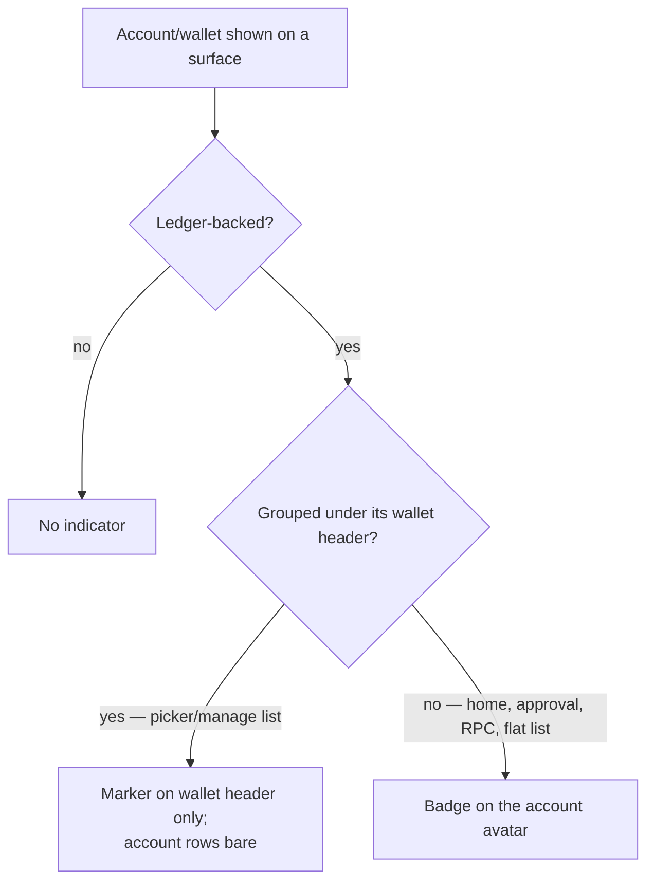

# Refine Ledger wallet/account indication in multi-wallet UI

## Summary

Replace the inconsistent per-row Ledger icon with an avatar-borne corner badge, shown by context across every surface that displays an account — the switch-account picker/manage sheet, the home/popup header, and the RPC/connect/signing approval dialogs. In grouped multi-account lists the marker is carried once on the wallet; everywhere an account appears without that grouping, it is carried on the account avatar. Software accounts stay unmarked.

---

## Problem Frame

Ledger indication today is inconsistent and slightly backwards. In the switch-account sheet, every account row under a Ledger wallet shows a small icon to the left of the row, while the wallet header — the thing that actually *is* the Ledger — shows nothing. The repetition adds clutter to dense lists, and stamping the same fact on every row is the signal context already provides.

The bigger gap is elsewhere: the home/popup header and the RPC/approval/signing dialogs show no Ledger indication at all, despite already having the wallet type available. That gap bites hardest in approval and signing flows, where a user needs to know up front that a Ledger account requires the physical device connected to proceed.

This is pre-launch polish for multi-wallet, not a defect — the aim is a treatment that reads as Ledger at a glance without crowding dense lists.

---

## Key Decisions

- **Avatar corner badge over a left-of-row icon or text label.** Reuse the existing `Avatar` `indicator` slot (bottom-right overlay) already used by swap for the chain badge and by activity for status. It unifies the treatment with the rest of the app, frees horizontal row width, and needs no new primitive. Rejected: a MetaMask-style "HARDWARE" text label, which clutters dense lists and truncates.
- **Context drives display, not a fixed per-row stamp.** Ledger-ness is a property of the wallet, inherited by its accounts. Show it once where context already groups accounts under their wallet, and on the account avatar wherever that grouping is absent.
- **Inline marker on the wallet header, not a new wallet avatar.** Wallet headers have no avatar today; an inline Ledger marker beside the wallet name is the lighter change and avoids introducing a wallet-avatar concept project-wide.
- **Software accounts stay unmarked.** The Ledger-vs-nothing contrast is the signal. Avoids implying a quality or security ranking between account types.

---

## Requirements

**Treatment**

- R1. Ledger indication renders as the `Avatar` corner `indicator` badge (bottom-right), containing `LedgerIcon` at `small` size, replacing the current left-of-row `Flag`+icon treatment in `account-list-item.layout.tsx`.
- R2. The badge keeps the opaque-background / ring treatment the `Avatar` indicator slot already provides, so it stays legible over any avatar background.

**Where it appears**

- R3. In grouped multi-account lists (the switch-account picker and manage sheet), the wallet header shows a Ledger marker inline beside the wallet name, and the account rows beneath a Ledger wallet show no badge.
- R4. On single-account surfaces — home/popup header, RPC transaction/message/PSBT signing approval, and connection/authentication approval — the account avatar carries the Ledger badge, even when the wallet name is also shown as a caption.
- R5. Software-backed wallets and accounts show no indicator on any surface.
- R6. The indicator behaves identically in the sheet's default (select) and manage modes.

**Accessibility**

- R7. The indicator carries a non-visual accessible label (e.g. "Ledger hardware wallet account") so the meaning is not conveyed by icon alone.

---

## Acceptance Examples

- AE1. **Covers R3.** Grouped picker, a Ledger wallet with three accounts → the wallet header shows the marker beside its name; the three account rows show no badge.
- AE2. **Covers R3, sticky header.** Scrolling that Ledger wallet's accounts in the picker → the wallet header stays pinned, so Ledger context remains visible while the account rows stay bare.
- AE3. **Covers R4.** Home/popup header showing a Ledger account → the account avatar shows the corner badge, with the wallet name still shown as caption.
- AE4. **Covers R4.** RPC signing approval ("With account…") for a Ledger account → the account card's avatar shows the badge.
- AE5. **Covers R5.** Any software account, on any surface → no indicator anywhere.

---

## Scope Boundaries

- Other hardware-wallet types. The model is `'ledger' | 'software'` today; keep the mechanism generic enough not to fight a future type, but don't build for one.
- Wallet-level avatars in the picker header — not introduced; the wallet marker is inline beside the name.
- Ledger-specific manage-mode actions (menu items) — unchanged.
- The swap chain-badge / token-avatar treatment — untouched.

---

## Dependencies / Assumptions

- The grouped picker uses Virtuoso `GroupedVirtuoso` with sticky group headers (confirmed in `switch-account-sheet.tsx`); the suppress-on-grouped rule (R3) relies on the wallet header staying pinned during scroll.
- All target surfaces already have wallet type via `useWalletEntities()` → `walletEntities[fingerprint].type`; no new data plumbing is needed to derive Ledger-ness.
- `AccountListItemLayout` is shared by the picker and the connection-approval dialog (`current-account-displayer.tsx`); changing its treatment affects both — intended.
- Account avatars do not currently carry a chain/network badge (that is swap's token avatars), so the corner `indicator` slot is free for Ledger. Keep the two from stacking on one avatar if that ever changes.
- The account avatar on these surfaces is `AccountAvatarItem` / `AccountAvatar` wrapping the UI `Avatar`; exposing the `indicator` through that wrapper is a planning detail.

---

## Sources / Research

**Code — current surfaces (all confirmed via codebase reads):**

- Shared account row: `apps/extension/src/app/components/account/account-list-item.layout.tsx` (current Ledger treatment, lines ~56–62).
- Picker/manage sheet + grouping: `apps/extension/src/app/features/dialogs/switch-account-sheet/switch-account-sheet.tsx`; wallet header: `.../components/wallet-header.tsx` (name only today).
- Home/popup header (also PSBT & message-signing headers): `apps/extension/src/app/features/container/headers/popup.header.tsx`; avatar `apps/extension/src/app/features/current-account/current-account-avatar.tsx`.
- RPC signing approval card: `apps/extension/src/app/features/rpc-stacks-transaction-request/signing-account-card/signing-account-card.tsx`.
- Connection/auth approval: `apps/extension/src/app/features/current-account/current-account-displayer.tsx`.
- Reusable pattern: `Avatar` `indicator` prop — `packages/ui/src/components/avatar/avatar.web.tsx` (web) and `avatar.native.tsx` (native); icon `packages/ui/src/icons/ledger-icon.web.tsx`; existing use in `apps/extension/src/app/pages/swap/components/asset-selector/asset-selector-list.tsx`.
- Wallet type: `apps/extension/src/app/store/common/wallet-type.selectors.ts` (`WalletType = 'ledger' | 'software'`).

**External design principles (transferable prior art):**

- Bottom-right corner = source/provenance metadata. The chain-badge-on-token pattern across Zerion/Rainbow/Phantom is the mature reference; OnchainKit ships a documented badge-on-avatar with a white ring ([docs.base.org/onchainkit/identity/badge](https://docs.base.org/onchainkit/identity/badge)).
- Suppress when a section header already conveys the type — MetaMask's repeated "HARDWARE" label is the documented failure mode ([avsa.medium.com](https://avsa.medium.com/on-metamask-main-navigation-ac8b756599b1)).
- Use a recognizable icon plus an accessible label, not color alone; keep the avatar ≥ ~32px for badge legibility in dense lists ([setproduct.com/blog/badge-ui-design](https://www.setproduct.com/blog/badge-ui-design)).
