# Multisig prototype import — apps/web design-only sandbox

## Summary

Import the standalone Leather Multisig prototype (~7,200 lines of Babel-in-browser JSX + a `ds/` folder of icons, illustrations, and color tokens) into `apps/web` as design-only routes under `pages/multisig/`. Translate to typed TSX with Panda CSS, reuse `@leather.io/ui` atoms where the prototype's primitives have direct equivalents, and follow the existing `pages/<area>/<area>.route.tsx` + `<area>.page.tsx` convention.

Replace the prototype's reviewer-facing **Tweaks panel** with a **navigable sandbox index** at `/multisig` that lists every meaningful (page × UI state × scenario) cell as a link, plus named journeys (ordered walks through the cross-product). Three axes, using established vocabulary:

- **Pages** — screens (dashboard, vault detail, account detail, tx detail, onboarding, settings, plus modals)
- **UI states** — Hurff's 5-state UI stack (blank / loading / partial / ideal / error), applied per-screen only where meaningful (see UI-state applicability table below)
- **Scenarios** — data-shape fixtures (zero-vaults, single-vault-creator, multi-vault-signer, pending-invitee, …). NOT personas — same user, different data shapes.

Delivered via a **fork of leather/mono**. Design work lives in the fork; the fork never opens a PR back to upstream. Edgar reviews by either browsing the fork on GitHub or adding it as a remote locally (`git remote add fork <url>`) and checking it out. Production code extraction is Edgar's downstream work — he cherry-picks from the fork or copies code into fresh branches on leather/mono, then opens normal PRs against main that go through full production code review.

---

## Problem Frame

The Leather multisig prototype currently exists only as a local Babel-in-browser sketch at `/Users/fabriciorosa/Work/local/Leather Multisig App/`. It covers the full multisig surface — onboarding, dashboard, vault hierarchy, modals, settings — but lives entirely outside the codebase. Edgar (the multisig maintainer in `leather/mono`) has already started the domain layer at `packages/services/src/multisig/multisig.service.ts`. The design has nowhere to land that Edgar can review and reason about against the actual production stack.

Edgar's agreed approach: import the designs into `apps/web/app/pages/multisig/` while he sets up Storybook in parallel. The work lands in a fork of `leather/mono`. Edgar then extracts pieces into clean production PRs against upstream at his pace.

**The thing that needs to be true at the end:** Edgar can browse the fork (on GitHub or via `git remote add fork <url>`), run `pnpm dev` from a checked-out fork, visit `/multisig`, and navigate every screen × scenario × UI-state combination via a categorized link list. Components are built against real Panda tokens and `@leather.io/ui` atoms. The taxonomy is consistent across screens. No real data wiring, no production routing, no shipping behavior — design artifacts staged for extraction.

---

## Scope Boundaries

### In scope

- All screens from the prototype's main multisig app: Onboarding, Dashboard, Vault Detail, Account Detail, Tx Detail, Settings
- All prototype modals: Create Vault, Create Account, Invite Accept, Send, Share Invites
- The `ds/` foundation: color/typography reconciliation against `@leather.io/tokens`, icon integration, illustration integration
- Shared multisig primitives: ChainPill, StatusPill, AvatarSq, AvatarCircle, multisig sidebar/header chrome
- A navigable sandbox index at `/multisig` covering pages, UI states, scenarios, and journeys
- Scenario fixtures (hand-authored, typed against `@leather.io/models` where possible)
- A minimal `ScenarioProvider` that reads URL params and injects fixture data into screens

### Deferred to Follow-Up Work

- **Production extraction of any screen into `@leather.io/ui` / `@leather.io/features` / `apps/extension`** — Edgar's downstream PRs, scoped by him
- **Real data wiring** — no React Query against multisig service yet; screens consume fixtures via context
- **Storybook integration** — Edgar's parallel work; component-state matrices live there once it lands
- **Mobile parity** — `apps/mobile` (React Native) is out of scope; this is web-only
- **Multisig service expansion** — `packages/services/src/multisig/multisig.service.ts` stays untouched
- **The extension popup integration** (`extension.jsx` in the prototype) — that's `apps/extension` work, scoped separately
- **Per-screen i18n** — strings are hard-coded English from the prototype; localization happens at production extraction
- **Index integrity lint rule beyond the spec test** — a CI-enforced linter for the sandbox index can come later

### Outside this product's identity

- Faker / generated fixtures — hand-authored only (research-validated anti-pattern)
- Controls / knobs / viewport switchers in the sandbox — resist the urge to rebuild Storybook
- Production navigation linking to `/multisig` — sandbox is reachable by URL only; never linked from the live site
- Tree-shaking the sandbox out of production builds — breaks Edgar's review workflow; keep it bundled

---

## Key Technical Decisions

### KTD-1 — Sandbox URLs flat, internal folder uses `_sandbox/` grouping

`/multisig` is the index landing. Screens live at `/multisig/dashboard`, `/multisig/vault/:vaultId`, etc. — URLs do not carry a `_sandbox` segment. Internal file organization uses `_sandbox/` as a folder grouping for index page + scenario provider + fixtures; this is a naming signal for "this is the sandbox infrastructure, not a screen."

**Rationale:** Polaris/Excalidraw precedent for unlinked-but-reachable sandbox routes inside real apps. URL cleanliness matters for reviewer ergonomics; folder naming matters for code organization. Decouple the two.

### KTD-2 — Per-screen React Router routes, not a container page with internal state

Each screen is a separate route in `apps/web/app/routes.ts`. Matches the surrounding apps/web convention. The sandbox index is just a hand-authored array of links; no state machine to maintain.

**Rationale:** Container-page-with-internal-state matches the prototype's `setRoute` shape but breaks navigation primitives (back button, deep-linking, URL-sharing for Edgar's review). Per-screen routes are the cheap default.

### KTD-3 — Three axes via URL query params: `?scenario=&state=`

`scenario` selects the data-shape fixture (zero-vaults, single-vault-creator, …). `state` selects the UI state (blank/loading/partial/ideal/error) when the screen has variants worth showing. Default scenario + state are picked per screen. URL params, not nested routes — cheap to add, cheap to delete, no route-tree explosion.

**UI-state applicability per screen** — not every screen has all 5 Hurff states. The sandbox index should only expose `?state=` for screens that actually vary on it:

| Screen | Applicable UI states | Rationale |
|---|---|---|
| Dashboard | blank, loading, partial, ideal, error | Data-rich screen; full taxonomy applies |
| Vault Detail | loading, ideal, error | No blank/partial — either the vault exists or it doesn't |
| Account Detail | loading, ideal, error | Same as Vault Detail |
| Tx Detail | ideal only (variants driven by scenario, not UI state) | Tx status (queued/pending/signed/broadcast/confirmed/failed/dropped/cancelled) is fixture-driven, not state-driven |
| Onboarding | ideal only (variants driven by scenario: which chains connected) | No data fetching; chain-connection state is the scenario axis |
| Settings | ideal only (variations are scenario-driven) | No data fetching; variations are config presets |
| Modals | n/a (steps are the axis via `?step=`) | Modals don't have UI states; multi-step flows have step states |

Screens with only `ideal` should not render `?state=` in their sandbox index entries — keeps the index honest about where variants exist.

**Rationale:** Research-validated (Polaris playground, Shopify scenario index) for the URL-param shape. Hurff's 5-state taxonomy is the vocabulary but not a universal applicability claim — pretending all screens have all 5 states adds fake structure. Existing `apps/web` precedent: `useSearchParams` is already used in `pages/support/search.tsx`.

### KTD-4 — Fixtures organized by scenario, NOT by page

`pages/multisig/_sandbox/fixtures/single-vault-creator.ts` exports the full data shape for that scenario, used across dashboard + vault detail + account detail. Avoids the anti-pattern of splitting one scenario across N per-page files where "pending-invitee" would require touching 10 files to update.

**Rationale:** Research called this out as the most common organization mistake. Scenarios are the unit of variation; pages just read from the active scenario.

### KTD-5 — Hand-authored fixtures, typed against `@leather.io/models` where it doesn't fight the prototype

Fixtures use real domain types (`Money`, `BtcBalance`, etc.) where they're already a clean fit. For multisig-specific shapes that don't have domain types yet (vaults, members, transactions in multisig states), use local interfaces colocated in `_sandbox/scenarios.ts`. Don't pre-invent service types — that's Edgar's territory.

**Rationale:** Existing `apps/web/app/pages/portfolio/dummy-portfolio-data.ts` precedent. Type fidelity where it's free, local interfaces where the domain layer hasn't landed yet.

### KTD-6 — `ScenarioProvider` wraps the multisig layout, injects via React Context

Screens read `useScenario()` to get `{ scenario, uiState, data }`. They don't know they're being previewed. The day Edgar extracts a screen to production, the provider call is replaced with real React Query hooks — minimal surgery.

**Rationale:** Decouple fixture concerns from screen concerns. Research-validated: "coupling fixtures to React Query internals" is an anti-pattern; provider indirection means swapping the data layer is a one-file change.

### KTD-7 — Token reconciliation: minimum-viable foundation pass upfront, then per-screen

U2 reconciles only the colors + typography tokens from `ds/colors_and_type.css` that are clearly needed across multiple screens. Per-screen reconciliation continues during U5-U8 as inconsistencies surface. Avoids upfront paralysis while ensuring the first screen has a real foundation.

**Rationale:** The prototype's `ds/` foundation predates `@leather.io/tokens`; full upfront mapping would block all screen work for days. Per-screen-only would result in token drift. Hybrid resolves both.

### KTD-8 — Sandbox index integrity guarded by a single test

`_sandbox/sandbox-index.spec.ts` asserts every entry in the index's link array resolves to a defined route in `apps/web/app/routes.ts`. Prevents drift (the most common rot mode for hand-authored indexes per the research).

**Rationale:** One test, prevents 80% of the rot the research flagged. Cheaper than CI lint rules; expressive enough to catch real failures.

### KTD-9 — Fork-based delivery; no PR back to upstream

Design work lives in a **fork of leather/mono**. Commit cadence inside the fork is unconstrained — squash, multiple commits, whatever feels right; the fork is the designer's workspace. No PR is ever opened from the fork back to upstream `leather/mono`. Edgar reviews via the fork directly (GitHub UI or `git remote add fork`). Production extraction happens via fresh PRs on `leather/mono` written by Edgar (or another engineer) — those PRs go through full production code review at that point. Cherry-pick from fork → main, or just copy files; either works.

**Rationale:** Decided in team meeting (2026-05-26). Adriano (CTO) raised that code in the production repo must meet production code review standards — so either the design code is subject to that (kills the workflow's iteration value) or it lives outside the production repo entirely. A fork satisfies the latter at the lowest operational cost: zero new scaffolding to set up, dependency graph inherited from upstream, upstream changes pullable via `git fetch upstream`. Edgar and Andres are indifferent on fork-vs-branch; fork wins on (a) cleaner governance, (b) no hanging design branches polluting leather/mono's branch list.

---

## High-Level Technical Design

*This illustrates the intended approach and is directional guidance for review, not implementation specification.*

How URL → fixture → rendered screen flows through the sandbox:

```mermaid
flowchart LR
    URL["/multisig/dashboard?scenario=multi-vault-signer&state=loading"]
    URL --> Router["React Router v7<br/>routes.ts"]
    Router --> Layout["MultisigLayout<br/>(wraps all /multisig/* routes)"]
    Layout --> Provider["ScenarioProvider<br/>reads search params"]
    Provider --> Registry["_sandbox/scenarios.ts<br/>fixtures/* lookup"]
    Registry --> Context["React Context<br/>{ scenario, uiState, data }"]
    Context --> Screen["DashboardPage<br/>useScenario()"]
    Screen --> Render["Rendered with fixture data<br/>+ UI state variant"]

    SandboxIndex["/multisig (sandbox index)"] -.->|"hand-authored<br/>link array"| URL
```



Three artifacts hold the cross-product:

1. **`_sandbox/scenarios.ts`** — the scenario registry. One typed export per scenario: `{ id, label, fixture: MultisigScenarioFixture }`.
2. **`_sandbox/sandbox-index.page.tsx`** — the link array. Hand-authored, only meaningful cells. Grouped by page. Includes a "Journeys" section with ordered walks.
3. **`_sandbox/scenario-provider.tsx`** — the indirection layer. Reads `?scenario=` and `?state=` from URL, looks up the fixture, provides it via context.

Anti-patterns to actively avoid (per the convention research):
- No `<ControlsPanel>` or `<KnobsBar>` overlay — sandbox is just the real app at a real URL
- No automatic cross-product enumeration — hand-authored index only, only meaningful cells
- No per-page fixture splits — scenarios own their full data shape across screens

---

## Output Structure

The full directory layout after the import lands:

```
apps/web/app/pages/multisig/
├── multisig.route.tsx                # /multisig — sandbox index landing
├── multisig.layout.tsx               # wraps all /multisig/* routes; mounts ScenarioProvider
├── multisig-routes.ts                # the prefix('multisig', [...]) block; routes.ts spreads this in one line
├── _sandbox/
│   ├── sandbox-index.page.tsx        # categorized link list + journeys section
│   ├── sandbox-index.spec.ts         # integrity test: every link resolves
│   ├── scenario-provider.tsx         # URL params → fixture → context
│   ├── scenario-provider.spec.ts     # provider unit test
│   ├── scenarios.ts                  # registry of named scenarios
│   ├── ui-states.ts                  # the 5 UI state constants
│   ├── journeys.ts                   # named ordered walks
│   ├── README.md                     # convention docs for future contributors
│   └── fixtures/
│       ├── zero-vaults.ts
│       ├── single-vault-creator.ts
│       ├── multi-vault-signer.ts
│       ├── pending-invitee.ts
│       ├── cancelled-vault-history.ts
│       └── ... (one per scenario)
├── dashboard/
│   ├── dashboard.route.tsx
│   ├── dashboard.page.tsx
│   └── components/
│       ├── vault-card.tsx
│       ├── tx-row.tsx
│       ├── create-vault-tile.tsx
│       └── member-status-pill.tsx
├── vault/
│   ├── vault.route.tsx               # /multisig/vault/:vaultId
│   ├── vault.page.tsx
│   └── components/
│       ├── vault-hero.tsx
│       ├── members-section.tsx
│       └── accounts-list.tsx
├── account/
│   ├── account.route.tsx             # /multisig/vault/:vaultId/account/:accountId
│   ├── account.page.tsx
│   └── components/
│       └── account-tx-list.tsx
├── tx/
│   ├── tx.route.tsx                  # /multisig/vault/:vaultId/tx/:txId
│   ├── tx.page.tsx
│   └── components/
│       ├── tx-status-timeline.tsx
│       └── signer-rollcall.tsx
├── onboarding/
│   ├── onboarding.route.tsx
│   ├── onboarding.page.tsx
│   └── components/
│       └── connect-row.tsx
├── settings/
│   ├── settings.route.tsx
│   └── settings.page.tsx
├── modals/
│   ├── create-vault-modal.tsx
│   ├── create-account-modal.tsx
│   ├── invite-accept-modal.tsx
│   ├── send-modal.tsx
│   ├── share-invites-modal.tsx
│   └── components/
│       ├── stepper.tsx
│       └── share-invite-card.tsx
└── components/                       # shared multisig primitives
    ├── chain-pill.tsx
    ├── status-pill.tsx
    ├── avatar-sq.tsx
    ├── avatar-circle.tsx
    ├── multisig-sidebar.tsx
    └── multisig-page-header.tsx
```

This structure is a scope declaration showing the expected output shape. Per-unit `**Files:**` sections remain authoritative for what each unit creates. The implementer may adjust if implementation reveals a better layout — particularly the modal organization and the boundary between `pages/multisig/components/` and per-screen `components/` folders, which are best decided when the second consumer of a primitive shows up.

---

## Implementation Units

### U1a. Routing shell + sandbox index skeleton

**Goal:** Establish only the routing surface and an empty sandbox index page at `/multisig`. Zero behavior — pure wiring. Dev server must boot cleanly with `/multisig` reachable.

**Requirements:** Foundational; U1b adds the behavior.

**Dependencies:** None.

**Files:**
- `apps/web/app/pages/multisig/multisig.route.tsx` (create)
- `apps/web/app/pages/multisig/multisig.layout.tsx` (create)
- `apps/web/app/pages/multisig/_sandbox/sandbox-index.page.tsx` (create — empty index, no entries yet)
- `apps/web/app/pages/multisig/_sandbox/README.md` (create — convention docs scaffold)
- `apps/web/app/pages/multisig/multisig-routes.ts` (create — the multisig `prefix('multisig', [...])` block; index route only at this point)
- `apps/web/app/routes.ts` (modify — **single line**: spread `...multisigRoutes` before the `// Fallback route` comment; never touched again after this unit)

**Approach:**
- `multisig.route.tsx` wraps `<SandboxIndexPage />` in `<WhenClient fallback={<SandboxIndexSkeleton />}>` per the SSR pattern used in `apps/web/app/pages/portfolio/portfolio.route.tsx`. This avoids hydration mismatch when `useSearchParams` reads URL state on the client
- `multisig.layout.tsx` renders an `<Outlet />` only — the ScenarioProvider lives in U1b and gets mounted here once it exists
- Sandbox index renders a categorized link list with a committed visual structure:
  - **Header**: "Multisig Sandbox" + one-paragraph description of the three axes
  - **Per-page rows**: page name (left, link to default cell), scenarios (middle, list of links per scenario), states (right, inline tags when meaningful)
  - **Single-axis screens** (those declared `ideal only` in KTD-3 — onboarding, settings, tx detail): omit the states column entirely; the scenarios column spans the freed width. No empty placeholder or disabled tag
  - **Responsive**: the index is desktop-first (Edgar reviews on a laptop). Below the apps/web standard tablet breakpoint, each row stacks vertically — page name, then scenario links, then state tags. No mobile optimization
  - **Journeys section** (added in U9): named ordered walks
  - Empty in U1a — populated as U5-U8 add entries to the index array
- **Isolate multisig routes to their own file** to minimize the upstream-sync conflict surface. Create `apps/web/app/pages/multisig/multisig-routes.ts` exporting the multisig `prefix('multisig', [...])` block (index route only at this point). In `apps/web/app/routes.ts`, add a **single line** that spreads it in immediately before the `// Fallback route` comment (above the splat `route('*', ...)`): `...multisigRoutes,`. This means `routes.ts` itself is touched exactly once (in U1a); subsequent units (U5-U8) extend `multisig-routes.ts`, which upstream never touches — so `git fetch upstream && git merge` won't conflict on multisig route registration
- Each subsequent unit (U5-U8) registers its own routes by extending the prefix block. This avoids U1 declaring routes that point at files which don't yet exist (dev server crashes on resolution)

**Patterns to follow:**
- `apps/web/app/pages/portfolio/portfolio.route.tsx` for the `WhenClient` SSR wrap pattern
- `apps/web/app/layouts/page/page.tsx` for layout wrapper style

**Test scenarios:**
- Test expectation: none — pure scaffolding/routing; no behavior to verify.

**Verification:**
- `pnpm --filter @leather.io/web typecheck` passes
- `pnpm --filter @leather.io/web dev` boots; visiting `/multisig` renders the empty sandbox index without errors or hydration warnings
- No `/multisig/dashboard` etc. routes exist yet — those land in U5-U8

---

### U1b. ScenarioProvider + URL state injection

**Goal:** Build the behavior layer — read URL params, look up scenario from registry, expose via React Context.

**Requirements:** Required by U5-U8 (every screen consumes `useScenario()`).

**Dependencies:** U1a (layout exists to mount the provider in), U3 (scenarios registry exists to look up from). Order in practice: U1a → U3 → U1b. If U3 isn't ready, U1b can land first with a stub registry.

**Files:**
- `apps/web/app/pages/multisig/_sandbox/scenario-provider.tsx` (create)
- `apps/web/app/pages/multisig/_sandbox/scenario-provider.spec.ts` (create)
- `apps/web/app/pages/multisig/_sandbox/ui-states.ts` (create — exports the 5-state constants)
- `apps/web/app/pages/multisig/multisig.layout.tsx` (modify — mount `<ScenarioProvider>` around `<Outlet />`)

**Approach:**
- `ScenarioProvider` reads `?scenario=` and `?state=` via `useSearchParams()`; falls back to a per-route default; exposes `{ scenarioId, uiState, data }` via a context
- `useScenario()` hook returns the context value; throws if used outside the provider
- Per-route defaults are declared by each screen via a `defaultScenarioId` constant — keeps the provider stateless and the defaults adjacent to the consumer
- Each screen route also wraps in `<WhenClient>` to avoid hydration mismatch on first paint (same pattern as `apps/web/app/pages/portfolio/portfolio.route.tsx`)

**Patterns to follow:**
- `apps/web/app/pages/portfolio/portfolio.route.tsx` for `WhenClient` SSR pattern
- `apps/web/app/pages/support/search.tsx` for client-side URL state reading

**Test scenarios:**
- Covers KTD-3 / KTD-6. `scenario-provider.spec.ts`:
  - When URL is `?scenario=multi-vault-signer&state=loading`, `useScenario()` returns the matching fixture and `uiState: 'loading'`
  - When `?scenario=` is missing, defaults to the route's declared default scenario
  - When `?scenario=` is an unknown id, falls back to default and logs a dev-only warning (does not throw)
  - When `?state=` is an unknown state, falls back to `'ideal'`
  - Using `useScenario()` outside `<ScenarioProvider>` throws a descriptive error

**Verification:**
- `pnpm --filter @leather.io/web typecheck` and `test:unit` pass
- Manual: visiting `/multisig?scenario=multi-vault-signer` and reading `useScenario()` in a stub consumer returns the right fixture

---

### U2. Foundation reconciliation — colors, typography, icons, illustrations

**Goal:** Bridge the prototype's `ds/` folder against the existing Panda + `@leather.io/tokens` foundation. Reconcile colors and typography upfront; integrate icons and illustrations.

**Requirements:** Prerequisite for any visual fidelity. Screen units assume the foundation exists.

**Dependencies:** None (can run parallel to U1).

**Files:**
- `apps/web/app/pages/multisig/_sandbox/README.md` (extend — document any prototype-only token additions)
- `apps/web/public/multisig/icons/*.svg` (copy from `/Users/fabriciorosa/Work/local/Leather Multisig App/ds/icons/`)
- `apps/web/public/multisig/illustrations/*` (copy from `ds/illustrations/`)
- `apps/web/app/pages/multisig/components/multisig-icon.tsx` (create — thin `` wrapper for prototype icons, mirroring the prototype's `<Icon name="...">` API)
- Possibly: `packages/tokens/src/...` modifications if specific tokens are clearly missing (chain-pill glyph color, status-pill tints, squircle avatar treatment) — flag for Edgar review rather than commit speculative token additions

**Approach:**
- Read `/Users/fabriciorosa/Work/local/Leather Multisig App/ds/colors_and_type.css` end-to-end
- Map each `--var` against `@leather.io/tokens` and Panda's existing theme:
  - **Direct match** → use the token; record the mapping in the sandbox README
  - **Close-but-not-exact** → use the closest Panda token and note the drift; flag for Edgar review at extraction time
  - **No match** → temporarily use inline values with a `// TOKEN-GAP: <description>` comment so the screen lands. **At the end of U2**, batch all TOKEN-GAP entries into a single proposed addition to `@leather.io/tokens` and surface it to Edgar as a separate small PR before any screen units (U5-U8) start in earnest. The screens then consume the new tokens; the comments disappear. Edgar gets one focused review surface for token additions instead of an audit queue at extraction time
- Copy `ds/icons/*.svg` and `ds/illustrations/*` to `apps/web/public/multisig/` so the prototype's `<Icon name="...">` API can be mirrored with ``. Document this as the design-only icon path; production extraction will route icons through `@leather.io/ui` or the icon registry Edgar prefers. **Caveat**: `` icons can't be recolored via `currentColor` — if a prototype icon appears in multiple chain colors, copy a per-color SVG variant rather than expecting CSS to recolor
- Audit the prototype's typography scale against Panda's `textStyle` tokens

**Patterns to follow:**
- `apps/web/app/pages/portfolio/dummy-portfolio-data.ts` for how domain-typed values are constructed in design-only files
- `packages/ui/src/...` Panda theme files for token vocabulary
- `apps/web/panda.config.ts` for active theme overrides

**Execution note:** This unit benefits from a survey-first approach — read the full `ds/colors_and_type.css` and the prototype's most-frequented components before touching tokens, then make the mapping in one pass rather than incrementally.

**Test scenarios:**
- Test expectation: none — foundation/styling work; visual reconciliation happens in U9's consistency pass.

**Verification:**
- Sandbox README documents every token mapping decision
- TOKEN-GAP comments are searchable across the multisig folder for Edgar's extraction-time review
- `pnpm --filter @leather.io/web typecheck` passes

---

### U3. Scenario registry and fixtures

**Goal:** Define the named scenarios (data-shape fixtures) used across screens, organized by scenario rather than by page.

**Requirements:** Prerequisite for U5-U8 (every screen reads from the scenario context).

**Dependencies:** U1 (scenario provider exists).

**Files:**
- `apps/web/app/pages/multisig/_sandbox/scenarios.ts` (create — the registry + shared local interfaces)
- `apps/web/app/pages/multisig/_sandbox/fixtures/zero-vaults.ts` (create)
- `apps/web/app/pages/multisig/_sandbox/fixtures/single-vault-creator.ts` (create)
- `apps/web/app/pages/multisig/_sandbox/fixtures/multi-vault-signer.ts` (create)
- `apps/web/app/pages/multisig/_sandbox/fixtures/pending-invitee.ts` (create)
- `apps/web/app/pages/multisig/_sandbox/fixtures/cancelled-vault-history.ts` (create)
- Additional scenarios as the screens reveal them (e.g., `mixed-chains-active`)

**Approach:**
- Read the prototype's `data.jsx` to extract `VAULTS_INITIAL`, `MEMBERS_STX_FRESH`, `MEMBERS_BTC_FRESH` and any other seed data
- Define local interfaces in `scenarios.ts` for multisig-specific shapes (Vault, Member, MultisigTx, MultisigAccount). Use `@leather.io/models` for primitives where it fits (`Money`, `BtcBalance`, `StxBalance`); local interfaces for everything else
- One fixture file per scenario; each exports a typed `MultisigScenarioFixture` with the full data shape across all screens
- Registry (`scenarios.ts`) exports a typed array: `{ id, label, description, fixture }[]`
- Convert the prototype's reviewer presets (`homeState: "zero"/"populated"`, `membersState: "fresh"/"joined"`) into discrete named scenarios — `zero-vaults`, `single-vault-creator`, `multi-vault-signer`, etc.

**Fixture quality contract** — the fixtures' job is to surface design problems, not hide them:
- **Member names**: plausible human names from a varied set (not "User1", not all four-letter names). Include at least one name long enough to stress truncation (e.g., "Alexandra Vasilenko-Hartwig"). Mix scripts where the design must support it.
- **Vault names**: domain-plausible labels users would actually pick — "Family Savings — BTC", "Lightning Operating Fund", "Treasury (Q2 2026)" — not "Vault A", "Test Vault", "My Vault"
- **Amounts**: span the realistic range — small (~10 sats), large (≥1 BTC equivalent), round numbers AND precise decimals. Mix of zero balances, mid-range, and "wallet has more than the user realized"
- **Addresses**: real-shaped Bitcoin/Stacks addresses from the prototype's existing seed data. Never use placeholder strings like `bc1q...test`
- **Timestamps**: spread across realistic windows — minutes-ago, hours-ago, days-ago, weeks-ago — so relative-time formatting is exercised
- **Status mix**: every scenario should include at least one transaction in each of the prototype's status states the scenario is meant to demonstrate (don't have a "multi-vault-signer" with only confirmed txs — include pending, signed-ready, and confirmed)
- **Edge characters**: at least one member name or vault name with a non-ASCII character (umlaut, apostrophe) to catch encoding issues

**Patterns to follow:**
- `apps/web/app/pages/portfolio/dummy-portfolio-data.ts` for hand-authored fixture style with domain types

**Test scenarios:**
- Test expectation: none — fixture data; TypeScript catches type errors. The integrity test in U9 will assert scenarios are discoverable.

**Verification:**
- `pnpm --filter @leather.io/web typecheck` passes
- All scenarios are importable from `scenarios.ts`
- Each fixture's shape conforms to the `MultisigScenarioFixture` interface

---

### U4. Shared multisig primitives

**Goal:** Implement the small set of cross-screen multisig-specific primitives — chain pill, status pill, avatars, sidebar/header chrome — colocated in `pages/multisig/components/`. Reuse `@leather.io/ui` atoms where they map.

**Requirements:** Prerequisite for U5-U8 (every screen consumes these).

**Dependencies:** U2 (foundation tokens must exist), U1 (only for layout consumption, not strictly blocking).

**Files:**
- `apps/web/app/pages/multisig/components/chain-pill.tsx` (create)
- `apps/web/app/pages/multisig/components/status-pill.tsx` (create)
- `apps/web/app/pages/multisig/components/avatar-sq.tsx` (create)
- `apps/web/app/pages/multisig/components/avatar-circle.tsx` (create)
- `apps/web/app/pages/multisig/components/multisig-sidebar.tsx` (create)
- `apps/web/app/pages/multisig/components/multisig-page-header.tsx` (create)
- `apps/web/app/pages/multisig/_sandbox/README.md` (extend — document `@leather.io/ui` gaps surfaced during this unit)

**Approach:**
- For each prototype primitive (`ChainPill`, `StatusPill`, `AvatarSq`, `AvatarCircle`, `Sidebar`, `PageHeader` in `components.jsx`):
  - Identify the closest `@leather.io/ui` atom (e.g., `Avatar`, `Badge`, `Chip`, `Flag`)
  - If the atom can carry the prototype's visual intent with minor styling, wrap it
  - If the prototype primitive has shape the atom can't carry (e.g., chain-glyph pill with a `logo` variant; squircle avatar with chain-dot overlay), build a new component in `pages/multisig/components/`. Document the gap in the sandbox README for Edgar
- The `STATUS_PILL_MAP` from the prototype (queued/pending/signed/broadcast/confirmed/failed/dropped/cancelled/Testnet) maps to typed status values; use a discriminated union
- Honor `@leather.io/ui` import shape — `import { Avatar, Badge } from '@leather.io/ui'`
- Use `Box`, `Flex`, `styled` from `leather-styles/jsx` for layout
- Responsive breakpoint convention: `[mobile, tablet, desktop]` array syntax (per `apps/web/app/layouts/page/page.tsx` precedent)

**Patterns to follow:**
- `apps/web/app/components/section-heading.tsx` for thin component style
- `apps/web/app/layouts/page/page.tsx` for Flex + responsive array conventions
- `packages/ui/src/components/avatar/`, `packages/ui/src/components/badge/`, `packages/ui/src/components/chip/` for the atoms being wrapped

**Test scenarios:**
- Test expectation: none — visual primitives without behavior; tests added at production extraction.

**Verification:**
- Every prototype primitive has a typed counterpart in `pages/multisig/components/`
- Sandbox README lists every `@leather.io/ui` gap surfaced
- `pnpm --filter @leather.io/web lint` and `typecheck` pass

---

### U5. Dashboard screen + its components

**Goal:** Port the dashboard screen — the primary entry point after onboarding — with VaultCard, TxRow, CreateVaultTile, and recent-activity surfaces.

**Requirements:** Reference behavior matches `screens.jsx` Dashboard (lines ~97-196 of the prototype).

**Dependencies:** U1, U2, U3, U4.

**Files:**
- `apps/web/app/pages/multisig/dashboard/dashboard.route.tsx` (create)
- `apps/web/app/pages/multisig/dashboard/dashboard.page.tsx` (create)
- `apps/web/app/pages/multisig/dashboard/components/vault-card.tsx` (create)
- `apps/web/app/pages/multisig/dashboard/components/tx-row.tsx` (create)
- `apps/web/app/pages/multisig/dashboard/components/create-vault-tile.tsx` (create)
- `apps/web/app/pages/multisig/dashboard/components/member-status-pill.tsx` (create)
- `apps/web/app/pages/multisig/_sandbox/sandbox-index.page.tsx` (extend — add dashboard entries)

**Approach:**
- Read `useScenario()` to pull the active fixture's vault list + transactions
- Branch rendering on `uiState`:
  - `blank` — empty state with CreateVaultTile and onboarding callout (the prototype's `homeState: "zero"`)
  - `loading` — skeleton variant (mirror the portfolio page's skeleton pattern)
  - `partial` — partial data, e.g., vaults but no transactions yet
  - `ideal` — full populated state (the prototype's `homeState: "populated"`)
  - `error` — error callout with retry affordance (decide visual treatment from the prototype's toast/error language)
- VaultCard, TxRow, CreateVaultTile colocated as page-local components (consistent with portfolio page's `components/` folder)
- MemberStatusPill is dashboard-local (only appears here per prototype scan); promotable to `pages/multisig/components/` if a second consumer shows up in U6-U8
- Responsive breakpoints: vault grid wraps at the apps/web standard tablet breakpoint; check responsive arrays in `pages/portfolio/components/portfolio-page.layout.tsx`

**Patterns to follow:**
- `apps/web/app/pages/portfolio/portfolio.page.tsx` for skeleton + layout + page state branching
- `apps/web/app/pages/portfolio/components/portfolio-page.layout.tsx` for responsive grid

**Test scenarios:**
- Test expectation: none — visual screen rendering fixture data; tests added at production extraction when real query hooks replace the scenario context.

**Verification:**
- Visiting `/multisig/dashboard` renders without console errors under every defined scenario
- All 5 UI states are reachable via `?state=...` query param
- Sandbox index lists every meaningful (dashboard × scenario × state) cell

---

### U6. Vault hierarchy screens — Vault Detail, Account Detail, Tx Detail

**Goal:** Port the drill-down chain: vault detail (members + accounts + recent activity), account detail (account balance + tx list), tx detail (status + signer rollcall + broadcast affordances).

**Requirements:** Reference `screens.jsx` VaultDetail (~198-380), AccountDetail (~382-491), TxDetail (~500-740).

**Dependencies:** U1, U2, U3, U4, U5 (shared patterns from dashboard).

**Files:**
- `apps/web/app/pages/multisig/vault/vault.route.tsx` (create — `/multisig/vault/:vaultId`)
- `apps/web/app/pages/multisig/vault/vault.page.tsx` (create)
- `apps/web/app/pages/multisig/vault/components/vault-hero.tsx` (create)
- `apps/web/app/pages/multisig/vault/components/members-section.tsx` (create)
- `apps/web/app/pages/multisig/vault/components/accounts-list.tsx` (create)
- `apps/web/app/pages/multisig/account/account.route.tsx` (create — `/multisig/vault/:vaultId/account/:accountId`)
- `apps/web/app/pages/multisig/account/account.page.tsx` (create)
- `apps/web/app/pages/multisig/account/components/account-tx-list.tsx` (create)
- `apps/web/app/pages/multisig/tx/tx.route.tsx` (create — `/multisig/vault/:vaultId/tx/:txId`)
- `apps/web/app/pages/multisig/tx/tx.page.tsx` (create)
- `apps/web/app/pages/multisig/tx/components/tx-status-timeline.tsx` (create)
- `apps/web/app/pages/multisig/tx/components/signer-rollcall.tsx` (create)
- `apps/web/app/pages/multisig/multisig-routes.ts` (modify — add the three nested routes to the multisig prefix block; `routes.ts` itself is not touched)
- `apps/web/app/pages/multisig/_sandbox/sandbox-index.page.tsx` (extend — add entries)

**Approach:**
- Route params drive which vault/account/tx is rendered; the active scenario fixture provides the underlying data
- If the URL param doesn't match anything in the fixture, render a **"not found in scenario" placeholder** (don't 404 — this is a design surface, the placeholder is part of the review). Spec:
  - One centered card with title "Not in this scenario"
  - Body: "Scenario `<scenarioId>` doesn't include a vault/account/tx with id `<paramValue>`."
  - Lists the ids the active scenario does contain (so reviewer can click into one)
  - Link back to `/multisig` (sandbox index)
  - Subtle visual treatment (not an error state) — it's a navigational dead end, not a failure
- TxDetail's status timeline maps to the `STATUS_PILL_MAP` taxonomy; build the timeline component to consume status values directly
- Signer rollcall: list members with signed/pending/skipped status; matches the prototype's `TxDetail` member iteration
- Per-screen UI state variants:
  - VaultDetail — ideal, loading, error; possibly "cancelled" as a scenario-driven variant rather than UI state
  - AccountDetail — ideal, loading, error
  - TxDetail — multiple variants by tx status (queued, pending, signed, broadcast, confirmed, failed, dropped, cancelled); these are scenario-driven, not UI-state-driven

**Patterns to follow:**
- U5's dashboard component organization (page-local `components/` folder)
- `apps/web/app/pages/stacking/pooled/` for nested route examples
- `apps/web/app/pages/portfolio/portfolio-table/` for table/list rendering patterns

**Test scenarios:**
- Test expectation: none — visual drill-down screens; tests added at production extraction.

**Verification:**
- All three screens reachable via the sandbox index under every scenario where the underlying data exists
- TxDetail correctly renders every status from the prototype's status taxonomy when driven by appropriate scenarios

---

### U7. Auxiliary screens — Onboarding, Settings

**Goal:** Port the standalone-shaped screens that don't fit the dashboard/drill-down hierarchy.

**Requirements:** Reference `flows.jsx` Onboarding (~33-71) and `screens.jsx`-adjacent Settings (~504-565 in `flows.jsx`).

**Dependencies:** U1, U2, U3, U4.

**Files:**
- `apps/web/app/pages/multisig/onboarding/onboarding.route.tsx` (create — `/multisig/onboarding`)
- `apps/web/app/pages/multisig/onboarding/onboarding.page.tsx` (create)
- `apps/web/app/pages/multisig/onboarding/components/connect-row.tsx` (create)
- `apps/web/app/pages/multisig/settings/settings.route.tsx` (create — `/multisig/settings`)
- `apps/web/app/pages/multisig/settings/settings.page.tsx` (create)
- `apps/web/app/pages/multisig/settings/components/settings-row.tsx` (create — if not promoted to a shared primitive)
- `apps/web/app/pages/multisig/multisig-routes.ts` (modify — add onboarding + settings routes)
- `apps/web/app/pages/multisig/_sandbox/sandbox-index.page.tsx` (extend)

**Approach:**
- Onboarding: chain connection rows for BTC and STX; UI state variants for "neither connected" / "one connected" / "both connected, ready to enter" — these map cleanly to scenarios, not UI states
- Settings: row-based config surface; variations covered by the prototype's `variation` prop (different feature sets). Treat each variation as a scenario, not a UI state
- These two screens have no internal data fetching even in production — they're forms + config. The fixture-driven approach maps cleanly

**Patterns to follow:**
- U5's dashboard component organization
- `apps/web/app/components/forms/` for form atoms if onboarding chooses any
- `@leather.io/ui` `Switch`, `Cell`, `Button` for settings rows

**Test scenarios:**
- Test expectation: none — visual screens; tests added at production extraction.

**Verification:**
- Both screens reachable via sandbox index; all scenarios render without errors

---

### U8. Modals

**Goal:** Port the prototype's modal flows — Create Vault (the largest, with steps), Create Account, Invite Accept, Send, Share Invites.

**Requirements:** Reference `flows.jsx` CreateVault (~87-345), CreateAccount (~347-391), InviteAccept (~393-432), SendModal (~433-503), ShareInvitesModal (~593-721).

**Dependencies:** U1, U2, U3, U4, U5 (dashboard renders modal triggers), U6 (vault/account/tx detail render their modal triggers).

**Files:**
- `apps/web/app/pages/multisig/modals/create-vault-modal.tsx` (create)
- `apps/web/app/pages/multisig/modals/create-account-modal.tsx` (create)
- `apps/web/app/pages/multisig/modals/invite-accept-modal.tsx` (create)
- `apps/web/app/pages/multisig/modals/send-modal.tsx` (create)
- `apps/web/app/pages/multisig/modals/share-invites-modal.tsx` (create)
- `apps/web/app/pages/multisig/modals/components/stepper.tsx` (create — shared by Create Vault flow steps)
- `apps/web/app/pages/multisig/modals/components/share-invite-card.tsx` (create)
- `apps/web/app/pages/multisig/_sandbox/sandbox-index.page.tsx` (extend — add modal entries with `?modal=create-vault` style query params)

**Approach:**
- Modals open via a URL query param read **only at the parent-screen boundary**: `/multisig/dashboard?modal=create-vault`. The parent screen reads `searchParams.get('modal')` and conditionally renders the modal, passing `currentStep`, `onNext`, `onPrev`, `onClose` as **props** to the modal. The modal itself is prop-driven from day one — it doesn't read the URL
- For Create Vault's multi-step flow, the parent screen also reads `?step=`. The Stepper consumes `currentStep` and `onNext` as props. **Form-field values inside the modal (vault name, member addresses, send amount) live in React component state — NOT URL params.** URL drives step navigation only; per-keystroke history pollution and focus loss on every input change are non-goals
- **Why prop-driven not URL-driven inside the modal:** at extraction time, Edgar's production form likely opens the modal via React state from a parent, not URL params. If the modal already takes props, extraction is a copy-paste swap of the parent's "read URL → render modal with props" boundary. If the modal reads URL internally, every step component is throwaway code at extraction
- `@leather.io/ui` exports `Sheet` and `Popover` — pick the right primitive per modal shape (Sheet for full-screen-ish flows, Popover for smaller overlays). Document the choice
- Share Invites contains a `FauxQR` component in the prototype — port it as-is for design fidelity; Edgar replaces with a real QR library at extraction

**Patterns to follow:**
- `apps/web/app/features/mock-dialog/`, `install-dialog/` for dialog/modal patterns in apps/web
- `packages/ui/src/components/sheet/` for Sheet API

**Test scenarios:**
- Test expectation: none — visual flows; tests added at production extraction.

**Verification:**
- Each modal openable from its parent screen via URL query param
- Stepper navigation in Create Vault works without remounting the modal
- All modals reachable from sandbox index entries (not just from in-screen triggers)

---

### U9. Sandbox completion — journeys, integrity test, consistency pass

**Goal:** Finalize the sandbox surface: journey sequences, the integrity test, and a token/spacing/breakpoint consistency pass across all imported screens.

**Requirements:** All screens and modals from U5-U8 exist. Edgar can navigate the full surface.

**Dependencies:** U1-U8.

**Files:**
- `apps/web/app/pages/multisig/_sandbox/journeys.ts` (create — named ordered walks)
- `apps/web/app/pages/multisig/_sandbox/sandbox-index.page.tsx` (extend — add Journeys section; finalize grouping/layout)
- `apps/web/app/pages/multisig/_sandbox/sandbox-index.spec.ts` (create — integrity test)
- `apps/web/app/pages/multisig/_sandbox/README.md` (extend — finalize convention docs, document scenario/journey naming, token-gap audit summary)
- Various screen/component files (touch-ups from the consistency pass)

**Approach:**
- Define 3-5 journeys as ordered arrays of sandbox-index entries. Each journey carries a one-sentence **design intent** (a `description` field in `journeys.ts`) stating what the reviewer should focus on — without it, a journey is just another nav mechanism:
  - "First-time signer creating their first vault" — onboarding → dashboard (blank) → create-vault modal → dashboard (single-vault-creator). *Intent: can a first-time user orient themselves? Focus on the blank-state legibility and the blank→populated transition.*
  - "Multi-vault signer reviewing a pending tx" — dashboard (multi-vault-signer) → vault detail → tx detail (pending) → tx detail (signed-ready). *Intent: does the signing-progress story read clearly across the drill-down? Focus on status continuity.*
  - "Invitee accepting a vault invitation" — dashboard (pending-invitee) → invite-accept modal → dashboard (single-vault-creator). *Intent: is the invite-accept moment legible and reassuring? Focus on the modal's clarity about what the user is joining.*
  - Plus 1-2 more as scenarios warrant
- Journeys section in the sandbox index renders each journey as a titled block: the design-intent sentence, then the ordered steps with "Next →" links between them
- Integrity test: parse the sandbox-index link array; for each entry, assert the route exists in `apps/web/app/routes.ts` and the scenario/state combination is defined. Tests fail if a link points nowhere.
- Consistency pass: walk every screen via the sandbox; check token usage (any inline color literals should be flagged), spacing scale (Panda spacing tokens, not arbitrary px), breakpoint behavior (resize check), typography. Fix as found.
- Final README pass: document the sandbox convention so future contributors and Edgar know what they're looking at

**Patterns to follow:**
- `apps/web/tests/` for test file location and structure (or colocated `.spec.ts` — check which apps/web uses for unit tests; `pages/portfolio/portfolio-events.tsx` doesn't have a spec, but the `vitest.config.js` setup determines location)
- `apps/web/app/pages/portfolio/portfolio-table/` for grouping conventions

**Execution note:** The consistency pass is the unit most likely to surface "I should change this in U4" or "I should re-do this in U5" — budget for going back to earlier units rather than papering over inconsistencies here.

**Test scenarios:**
- Covers KTD-8. `sandbox-index.spec.ts`. Most assertions are handled by TypeScript via a discriminated union on the index array type (`{ path: \`/multisig/${string}\`; scenarioId: ScenarioId; uiState?: UiState }`); the runtime test handles only what types can't:
  - **Runtime**: every `path` in the index array is reachable in the route table. Implementation: import the default export from `apps/web/app/routes.ts` (it's a real runtime value — `route()` and `prefix()` execute at module load and return concrete objects with the path already baked in). Iterate the flat default-export array and collect every node's `path`; assert every sandbox-index entry's `path` appears in the collected set. **No manual prefix concatenation needed** — `prefix()` already baked the full path into child objects at construction time
  - **TypeScript-only (no runtime assertion needed)**: `scenarioId` is constrained to known ids by the discriminated union; `uiState` is constrained to known states; missing fields are compile errors
  - **Runtime**: every journey's step array contains only valid index entries (cross-reference check) — same collected-set lookup as above

**Verification:**
- `pnpm --filter @leather.io/web test:unit` passes (sandbox integrity test green)
- `pnpm --filter @leather.io/web typecheck` passes
- `pnpm --filter @leather.io/web lint` passes
- `pnpm dev` starts cleanly; manual walkthrough of every journey works end-to-end
- Sandbox README is complete: convention overview, scenario list with descriptions, journey descriptions, token-gap audit summary

---

## Test Strategy

The plan's overall stance:

- **Sandbox infrastructure** (U1's scenario provider, U9's index integrity) — real unit tests. These are mechanisms with logic worth catching at refactor time.
- **All other units** — `Test expectation: none — design-only routes; tests added when Edgar extracts to clean PRs`. The screens render hand-authored fixtures; there is no behavior to verify beyond "does it render," and no production code is being shipped from the fork to upstream.

This is intentional: the fork is staged design artifacts, not production code. Tests live with the code Edgar extracts into upstream PRs.

Verification commands run during U9 (and at the end of every unit):

```
pnpm --filter @leather.io/web typecheck
pnpm --filter @leather.io/web lint
pnpm --filter @leather.io/web test:unit
```

Per CLAUDE.md, after any changes:

```
pnpm format
pnpm lint
pnpm typecheck
```

---

## Alternative Approaches Considered

### A. Port the Tweaks panel as a floating dev overlay

Rejected. The prototype's Tweaks panel is a single global "what state is the app in" toggle — it covers per-page presets but not the (page × UI state × scenario) cross-product. Porting it would keep an outdated reviewer affordance and miss the more useful navigable index. Also: research flagged "reinventing Storybook controls" as the anti-pattern that erodes sandbox value the fastest.

### B. One container page driving screens by internal state

Rejected (see KTD-2). Matches the prototype's `setRoute` shape but breaks deep-linking, back-button, and Edgar's "share this URL with me" review affordance. Per-screen React Router routes are simpler and match the surrounding apps/web convention.

### C. Faker-generated fixtures

Rejected (research-validated anti-pattern). Generated data hides design problems: real names matter, real long strings break layouts in ways short generated ones don't, edge cases are best authored deliberately. Hand-authored fixtures for ~10 screens is the right scale.

### D. Per-page fixture files

Rejected (KTD-4). Splits a single scenario across N files. To update "pending-invitee" you'd touch the dashboard fixture, the vault detail fixture, the invite-accept modal fixture, and so on. Organize by scenario, not by page.

### E. MSW-based mocking instead of a scenario provider

Rejected for this scope. `apps/web` already has MSW infrastructure (`MockModeToggle`, `~/mocks/api/`). Using it would mean writing fake API responses that React Query hooks consume. Heavier than needed — we don't have real React Query hooks yet, and the scenarios are about screen-level data shapes, not API responses. The scenario provider is the right scale; MSW becomes useful when Edgar wires real queries at extraction time.

### F. Path B — one-shot handoff PR under `docs/design/multisig/`

The May 26 deck (`docs/decks/2026-05-26-multisig-prototype-to-code-deck.md`) framed this as one of two paths: drop the prototype as code under `docs/design/multisig/` with a README acting as the visual contract; Edgar rebuilds against the real packages on his own cadence; the directory gets deleted in the PR that ships the last rebuilt surface. The deck's weak prior leaned toward this path for multisig specifically (well-defined scope, mostly one-shot).

Not chosen here because **Edgar specifically recommended starting in `apps/web/app/pages/multisig/`** so design iteration could happen in real Panda-rendered TSX rather than as static reference. The sandbox path costs more upfront work but produces a higher-fidelity review surface and lets the designer iterate in-code while Edgar's Storybook setup lands in parallel. Path B remains the right default for a future feature import where in-code iteration isn't useful (smaller surface, fully-final design, or no maintainer appetite for designer-in-PR-loop). The two paths complement each other; this plan picks the heavier one for the right reason.

### G. Branch in leather/mono that never merges

Considered and rejected after the 2026-05-26 team meeting. The premise — branch lives in `leather/mono`, never merges to main, engineers extract pieces via fresh PRs — would have technically kept unreviewed code out of the production code lineage. But Adriano flagged that *the design code existing in the production repo at all* (even on an unmerged branch) is the governance issue, not just whether it merges. Andres added that a long-lived design branch would also pollute leather/mono's branch list with experimental work, making pruning and review cleaner if the design work is segregated to its own Git remote.

A fork addresses both concerns at zero operational cost relative to a branch, so it won. See KTD-9 for the resolution.

---

## Dependencies / Prerequisites

- **Fork of `leather-io/mono` created** (Fabricio's account or a Stacks Labs org-level account, depending on which gives Edgar usable CI/preview access on the private parent — confirm with Adriano before forking). Clone, add `upstream` remote, confirm `git fetch upstream` works.
- **Fork CI surface verified.** Push an empty commit to the fork before U1a and observe which workflows actually run vs. silently no-op. Private-repo forks do **not** inherit org-level secrets — any workflow referencing `secrets.*` (Cloudflare deploy creds, LaunchDarkly keys, private-package tokens) will fail or skip on the fork. Likely outcome: `typecheck` / `lint` / `test:unit` run fine (no secrets needed); preview deploys won't. Document the actual CI surface in the sandbox README. If the integrity test (U9 / KTD-8) can't gate on the fork's CI, note that it must be run locally via `pnpm --filter @leather.io/web test:unit`.
- **Edgar's review method confirmed (in writing).** Before sinking U5-U9 effort: confirm with Edgar that he'll review by running `pnpm dev` and navigating `/multisig`, not by reading prototype source or the raw diff. The sandbox infrastructure (scenario provider, index, journeys) only pays off if he navigates the running surface. If he'd rather read static reference, switch to Path B (Alternative F) before U1a. A 15-minute Slack confirmation de-risks the plan's largest premise.
- **`pnpm i && pnpm build`** has been run (per CLAUDE.md first-time setup).
- **`apps/web` dev server boots** (`pnpm --filter @leather.io/web dev` runs cleanly before the import starts).
- **The prototype source files** at `/Users/fabriciorosa/Work/local/Leather Multisig App/` are accessible.

No upstream package changes are required from Edgar before this work starts. Token gaps surfaced during U2 are documented but not added to `@leather.io/tokens` speculatively — those are Edgar's call at extraction time.

---

## Risk Analysis & Mitigation

### R1. Token / foundation drift between sandbox and production

**Risk:** The sandbox accumulates inline color/spacing literals, hardcoded values, or close-but-not-exact token usage. When Edgar extracts a screen, he has to reconcile those drift points by hand, slowing extraction and risking visual regressions.

**Mitigation:**
- U2 establishes a minimum-viable foundation upfront so the first screen lands on real tokens
- TOKEN-GAP comments are searchable across the multisig folder so Edgar can audit them all in one pass
- U9's consistency pass explicitly checks for inline color literals and arbitrary spacing values
- The sandbox README maintains a running log of every token-mapping decision

### R2. `@leather.io/ui` atom gaps surface late

**Risk:** A screen needs a UI primitive that doesn't exist in `@leather.io/ui` (chain-glyph pill, squircle avatar with chain dot, status pill with spinner). Building it locally in `pages/multisig/components/` is fine for the design phase, but if many show up Edgar's extraction work bloats with "promote this to `@leather.io/ui`" sub-tasks.

**Mitigation:**
- U4 surfaces gaps upfront for the shared primitives
- Every prototype-only primitive lives in `pages/multisig/components/` (or per-screen `components/` if truly local) — never inline in screens — so promotion at extraction is a clean copy
- Sandbox README documents every `@leather.io/ui` gap so Edgar can prioritize promotion separately from screen extraction

### R3. Scenario provider context leaks across unrelated apps/web routes

**Risk:** `ScenarioProvider` is mounted via `multisig.layout.tsx` and scoped to `/multisig/*` routes. If wired incorrectly (e.g., mounted at the root layout), other pages would pick up the context and break.

**Mitigation:**
- `ScenarioProvider` is mounted in `multisig.layout.tsx`, not in `root.tsx` or `entry.client.tsx`. Provider scope is enforced by React Router's route nesting.
- `useScenario()` throws a descriptive error if used outside the provider — caught at dev time, not in production
- Route registration in `apps/web/app/routes.ts` explicitly nests under the `multisig` prefix

### R4. Sandbox index drifts from real routes (the most common rot mode per the research)

**Risk:** Someone renames a route, deletes a screen, or changes a scenario id; the sandbox index still links to the old shape, Edgar gets 404s when reviewing.

**Mitigation:**
- KTD-8 / U9's integrity test catches this at CI time
- The test runs as part of `pnpm test:unit` in `apps/web`, so it gates any commit that breaks the index

### R5. Modals' URL-driven open state collides with future production routing decisions

**Risk:** Edgar's production extraction may use a different modal-open mechanism (e.g., route-scoped state, not URL params). The sandbox's `?modal=create-vault` style won't transfer.

**Mitigation:**
- Modals are self-contained components in `pages/multisig/modals/` — extraction is a rewrite of the open mechanism, not a rewrite of the modal itself
- Document in the sandbox README that `?modal=...` is a sandbox-only affordance, not a recommended production pattern

### R6. Large diff makes review intimidating

**Risk:** ~5,000 lines of new TSX across 30+ files is hard to review even for Edgar, who's expected to extract piece-by-piece.

**Mitigation:**
- The sandbox index (browsable on the fork via `pnpm dev` or via a preview deploy) is the review entry point, not the diff. Edgar reviews by navigating the sandbox, not reading code line-by-line
- Folder structure is deliberately extraction-friendly: each screen's drill-down is self-contained, primitives are colocated or promoted to `pages/multisig/components/` so extraction can copy a folder
- The sandbox README walks Edgar through what's where and what to extract first

### R7. Fork goes stale during extended extraction timeline

**Risk:** Edgar extracts two screens, then gets pulled into other work for weeks. The fork sits unsynced; tokens shift in `@leather.io/tokens`, `@leather.io/ui` evolves, the remaining screens become rework instead of extraction.

**Mitigation:**
- Designer commits to periodic upstream sync — `git fetch upstream && git merge upstream/dev` at least every 2 weeks while extractions are active, and immediately before flagging Edgar for re-review
- **Conflict surface is minimized by design:** multisig route registration lives in `multisig-routes.ts` (touched only by the design work), and `routes.ts` is touched exactly once in U1a (a single spread line). Upstream edits to `routes.ts` therefore rarely conflict with the design work. The remaining conflict risk is shared config (`package.json`, `panda.config.ts`) — resolve those by taking upstream and reapplying the small design-side additions
- If the fork sits idle for >6 weeks with no extractions landing, treat it as superseded — archive it, log the lessons learned, and let future extraction work re-derive from prototype source
- The sandbox README's "what to extract first" list helps Edgar pick high-leverage starting points so the most valuable screens land before the fork can stale

---

## Operational / Rollout Notes

- **Setup (one-time, before U1a):** Fork `leather/mono` to a fab-stacks (or stacks-labs org) account. Clone the fork locally. Add upstream remote: `git remote add upstream git@github.com:leather-io/mono.git`. Confirm `git fetch upstream` works.
- **Working branch inside the fork:** `design/multisig` (or whatever you like — name doesn't matter since the fork is yours). Use any commit cadence that feels right.
- **Upstream sync cadence:** `git fetch upstream && git merge upstream/dev` periodically — at minimum weekly while iterating, immediately before flagging Edgar for review. Keeps the design system + token + atom imports current.
- **No PR back to upstream from the fork — ever.** Code only enters `leather/mono` via fresh PRs that Edgar (or another engineer) opens on the upstream repo, written normally and reviewed at production standard.
- **Rollback granularity** during development is per-implementation-unit — if a unit fails verification, fix or revert that unit's work before moving on; don't accumulate broken state across units.
- **Communication:** ping Edgar in Slack with the fork URL and the path `/multisig` to start at. He can add it as a remote (`git remote add fork <url>`) and `git fetch fork && git checkout fork/design/multisig`, or just browse the fork on GitHub.
- **CI:** the fork inherits `leather/mono`'s `.github/workflows/` *files*, but **not org secrets** — secret-dependent workflows (deploys, anything reading `secrets.*`) will fail or skip on a private-repo fork. Verify the actual surface per the Prerequisites step. Expect `typecheck` / `lint` / `test:unit` to run (no secrets needed) and the sandbox integrity test to gate via `test:unit`; don't assume deploy/preview workflows run.
- **Lifecycle:** the fork stays alive as a reference until Edgar's last extraction PR ships against upstream main. At that point, the entire `pages/multisig/` design surface gets deleted (or the fork archived) — Edgar's call when. The sandbox is by design a transitional artifact.

---

## Documentation Plan

- **`apps/web/app/pages/multisig/_sandbox/README.md`** — the convention doc. Covers:
  - `STATUS: v0 — provisional, scoped to multisig. Do not generalize until reviewed.` header at the very top (the forcing function from Future Considerations)
  - What the sandbox is (one paragraph)
  - The three axes (page / UI state / scenario) with vocabulary
  - How to add a scenario (one example)
  - How to add a screen to the sandbox index (one example)
  - Token-gap audit summary from U2 (running list)
  - `@leather.io/ui` atom gaps from U4 (running list)
  - A pointer to the design iteration toolkit doc (see below) for the design-pass tooling
  - "How Edgar extracts a screen to production" (the takeaway path)

No changes to existing repo-wide docs (CLAUDE.md, AGENTS.md). The sandbox README is the only documentation artifact this plan adds.

---

## Design iteration toolkit (separate doc)

The toolkit for the design-pass phase — Claude Code iteration modes, Tweakpane runtime tweaking, lazyweb reference skills, multi-viewport review, Figma round-trip, animation review, accessibility tooling, and a suggested rhythm — lives in a companion doc: [`docs/multisig-design-iteration-toolkit.md`](../multisig-design-iteration-toolkit.md). It's reference material for the iteration phase, deliberately kept out of this plan's implementation scope (none of U1a-U9 depend on it). Tweakpane in particular requires a one-time verification that Panda emits CSS custom properties for the target tokens — see the toolkit doc's caveat before building the panel.

---

## Future Considerations

These are deliberately NOT in scope for this plan, but inform later decisions:

- **Storybook integration.** Once Edgar's Storybook setup lands, the shared primitives in `pages/multisig/components/` get stories. Scenarios + UI-state reasoning probably stays in the sandbox (Storybook handles components, the sandbox handles app surfaces). The two surfaces complement each other.
- **Multisig service wiring.** When Edgar extracts the dashboard, the scenario provider gets replaced (for that screen) with real React Query hooks against `multisig.service.ts`. The fixture pattern transfers conceptually — the data shape is the same; only the source changes.
- **Mobile parity.** If multisig comes to `apps/mobile`, the scenarios become reusable (they're plain data). The screen TSX does not transfer (React Native vs DOM), but the data layer and the convention do.
- **Promoting the sandbox pattern to other feature imports — only if it earns the right.** The convention here is **v0, scoped to multisig**. To stop "provisional" from decaying into "permanent by inertia," there's an explicit forcing function: the sandbox README opens with a `STATUS: v0 — provisional, scoped to multisig. Do not generalize until reviewed.` header, and after Edgar's first three extractions land there's a named decision gate — a short retro that picks one of {promote the convention to a real shared doc, keep it multisig-only, or mark it for deletion}. Until that retro happens, no second feature import inherits this shape. Did the sandbox surface design problems earlier than Figma would have? Did Edgar actually use it as a review surface? Those answers decide promotion. Do NOT generalize from this single use case before the gate.
