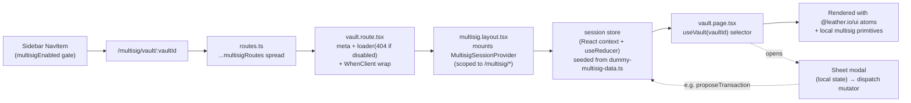

# Leather Multisig — UI port into apps/web as a real sidebar feature

## Summary

Port the standalone Leather Multisig prototype (a local Babel-in-browser React sketch, ~7,200 lines of JSX + a `ds/` token folder) into `apps/web` as a **real, sidebar-navigable feature area** under `/multisig`. Translate the prototype's JSX to typed TSX with Panda CSS (`leather-styles`), reuse `@leather.io/ui` web atoms wherever the prototype's primitives have direct equivalents, and follow the existing `pages/<area>/<area>.route.tsx` + `<area>.page.tsx` convention plus the `routes.ts` + sidebar `NavItem` registration pattern.

This is **UI-only**: no real wallet connection, no React Query against a multisig service, no persistence. Screens render hand-authored dummy data (mirroring `apps/web/app/pages/portfolio/dummy-portfolio-data.ts`), and a small scoped session store (React context + `useReducer`, scoped to the multisig layout) lets the create-vault / invite / send flows produce visible changes during a review session so reviewers can walk the product end-to-end. The store resets on reload and is the swap point for real query hooks at production extraction.

The feature is gated behind an env-target `multisigEnabled` flag (`production: false`), mirroring `advancedModeEnabled`. On a branch/staging Cloudflare preview the Multisig sidebar entry and routes are live; in production they are hidden. The branch ships as a draft PR against `dev`, giving developers a preview URL and a review surface for refinement.

The prototype's separate **extension popup surface** (`extension.jsx`) is out of scope — that is `apps/extension` work.

---

## Problem Frame

The Leather multisig design exists only as a local prototype outside the codebase. It already models itself as part of the Leather web app — its sidebar shows Portfolio, Stacking, sBTC, Apps, **Multisig**, Advanced, which is nearly identical to the real `apps/web` navigation (`apps/web/app/layouts/nav/nav.tsx`). The design needs to land in the actual web app as a navigable feature so the team and developers can experience it in the real shell, on a real preview URL, and iterate on it.

The earlier 2026-05-26 plan proposed a design-only, URL-only sandbox (never linked from nav) delivered in a fork. The team has since decided (2026-06-02) to instead build it as a real sidebar feature on a branch in `leather/mono`, delivered via PR for preview and review. This plan reflects that decision.

**The thing that must be true at the end:** A developer can check out the branch (or open the PR's Cloudflare preview), see a **Multisig** entry in the web app sidebar, click it, and navigate the full multisig surface — dashboard, vault detail, account detail, transaction detail, onboarding, settings, and every modal flow — rendered with real Panda tokens and `@leather.io/ui` atoms, against realistic dummy data, with flows that visibly respond. No production data wiring, no shipping behavior in production (gated off), no extension popup. The screens are close enough to production structure that extracting them into real query-backed features is incremental, not a rewrite.

**Validating the "incremental, not a rewrite" bet.** This claim is load-bearing — it's why we build real screens instead of a throwaway sandbox. To keep it from failing silently, the data seam (the `multisig-types.ts` shapes + the selector-hook boundary) should get a lightweight sign-off from Edgar (who owns `packages/services/src/multisig/multisig.service.ts`) early — ideally after U3 lands, before the bulk of screen work. If the dummy data shape or store-selector boundary diverges from what the real service will expose, catching it after one unit is cheap; catching it after nine is the rewrite we're trying to avoid.

---

## Scope Boundaries

### In scope

- **Sidebar integration** — a real `Multisig` `NavItem` in `apps/web/app/layouts/nav/nav.tsx`, gated by an env-target `multisigEnabled` flag.
- **Routing** — a `/multisig` route area registered in `apps/web/app/routes.ts`, isolated in a dedicated `multisig.routes.ts` to minimize merge-conflict surface.
- **All main multisig screens** from the prototype: Dashboard, Vault Detail, Account Detail, Transaction Detail, Onboarding, Settings.
- **All prototype modal flows**: Create Vault (full-screen sectioned form), Create Account, Invite Accept, Send, Share Invites.
- **The `ds/` foundation**: reconcile colors/typography against `@leather.io/tokens` (light pass — names already align), integrate icons (reuse `@leather.io/ui` icons where they exist; copy prototype-only glyphs/illustrations to `apps/web/public/multisig/`), and the multisig nav icon.
- **Shared multisig primitives**: ChainPill, StatusPill (status taxonomy), AvatarSq (squircle + chain badge + account-icon mask), AvatarCircle, MemberStatusPill, a multisig page header (back / title / actions), address display (reuse `AddressDisplayer` where it fits).
- **Hand-authored dummy data** typed against `@leather.io/models` where it fits, with local interfaces for multisig-specific shapes.
- **A minimal scoped session store** (React context + `useReducer`, scoped to the multisig layout) seeded from the dummy data, so create/invite/send flows produce visible feedback during review.
- **Feature README** documenting the design-only nature, the dummy-data/store seam, and `@leather.io/ui` gaps surfaced for production extraction.

### Deferred to Follow-Up Work

- **Production data wiring** — React Query against a multisig service; the in-memory store is the swap point. Edgar's domain layer (`packages/services/src/multisig/multisig.service.ts`) stays untouched.
- **Production extraction into `@leather.io/ui` / `@leather.io/features`** — promotion of stable primitives to shared packages is downstream work, scoped by the maintainer.
- **Enabling in production** — `multisigEnabled` stays `production: false` until the feature is real.
- **i18n / localization** — strings are hard-coded English from the prototype; localization happens at production extraction.
- **Mobile parity** — `apps/mobile` (React Native) is out of scope; web-only. (Web is responsive per existing breakpoints, but no RN port.)
- **Real QR generation** — the prototype's `FauxQR` is ported as-is; a real QR library is an extraction-time swap.
- **Comprehensive automated test coverage** — design-only screens carry no behavior tests; only the in-memory store and routing integrity get unit smoke tests (see Test Strategy).

### Outside this product's identity

- **The extension popup surface** (`extension.jsx`: connect, add-multisig-account, sign-tx scenes) — that is `apps/extension` work, scoped separately.
- **A scenario / UI-state switcher overlay** (the 2026-05-26 plan's ScenarioProvider + sandbox index, and the prototype's Tweaks panel) — explicitly dropped. This is a real navigable feature; state comes from navigation and flows, not a knobs panel. Resist rebuilding Storybook-in-the-app.
- **Faker / generated fixtures** — hand-authored only (research-validated anti-pattern from the prior plan).
- **Porting the prototype's `WalletStatus` header widget** — the web app already has its own header sign-in (`apps/web/app/layouts/page/page.tsx` `Page.Header` + `SignInButton`). Reuse it; do not port a second wallet-status control.

---

## Key Technical Decisions

### KTD-1 — Real routes integrated into the web app, isolated in `multisig.routes.ts`

The `/multisig` area is registered in `apps/web/app/routes.ts` via a **single spread** of `...multisigRoutes` (imported from `apps/web/app/pages/multisig/multisig.routes.ts`), placed immediately before the fallback `route('*', ...)` at the end of the array. All multisig route declarations live in `multisig.routes.ts` (a `prefix('multisig', [...])` block); `routes.ts` itself is touched exactly once.

**Rationale:** `routes.ts` is a hot file (250+ lines, frequently edited upstream). Isolating multisig routes to their own module means `git merge dev` never conflicts on route registration after the initial one-line add. Matches the merge-surface-minimization rationale validated in the 2026-05-26 plan (KTD-1/U1a), adapted to real (not sandbox) routing.

**Route map** (real React Router v7 nested routes, params drive which entity renders):

| URL | Screen | Prototype source |
|---|---|---|
| `/multisig` (index) | Dashboard | `screens.jsx:97` (`Dashboard`) |
| `/multisig/onboarding` | Onboarding | `flows.jsx:33` (`Onboarding`) |
| `/multisig/create-vault` | Create Vault (full-screen sectioned form) | `flows.jsx:87` (`CreateVault`) |
| `/multisig/settings` | Settings | `flows.jsx:599` (`Settings`) |
| `/multisig/vault/:vaultId` | Vault Detail | `screens.jsx:198` (`VaultDetail`) |
| `/multisig/vault/:vaultId/account/:accountId` | Account Detail | `screens.jsx:395` (`AccountDetail`) |
| `/multisig/vault/:vaultId/tx/:txId` | Transaction Detail | `screens.jsx:510` (`TxDetail`) |

Create Account, Invite Accept, Send, and Share Invites are **modals** (overlays on their parent screen), not routes — see KTD-5.

### KTD-2 — Feature gated by an env-target `multisigEnabled` flag (not LaunchDarkly)

`apps/web` does not use LaunchDarkly; it gates features by build/env target via `whenEnvTarget` (`apps/web/app/constants/environment.ts`). Export `multisigEnabled = whenEnvTarget({ development: true, branch: true, staging: true, production: false })` from the multisig route module and gate the sidebar `NavItem` with it. This composes **two existing patterns** (no single route does both today):
- **Nav-entry gating** mirrors `advancedModeEnabled` in `apps/web/app/pages/advanced/advanced.route.tsx`, consumed at `nav.tsx:52` — note `advancedModeEnabled` ships `production: true`, so multisig deliberately diverges to `production: false`. `advanced.route.tsx` has **no `loader` and no 404 gate**; it gates only the nav entry.
- **Loader-level 404 gating** mirrors the stacking routes' param-not-found pattern (`throw data('...', { status: 404 })` in `apps/web/app/pages/stacking/pooled/pooled-stacking.route.tsx`). The multisig route's `loader` throws a 404 when `!multisigEnabled` so the URL isn't reachable in production even by direct entry.

**Rationale:** `production: false` + Cloudflare branch previews is precisely the "share a preview with developers" workflow the user wants — the PR's branch deploy shows the feature; production stays clean. The mechanism is composed from two proven in-repo patterns rather than one; both pieces exist, so the risk is integration, not novelty.

### KTD-3 — UI-only data via hand-authored fixtures + a scoped React-context session store

Two layers:
1. **`dummy-multisig-data.ts`** — hand-authored seed data (vaults, accounts, transactions, members), typed against `@leather.io/models` (`Money`, balances) where it fits and local interfaces for multisig-specific shapes. Mirrors `apps/web/app/pages/portfolio/dummy-portfolio-data.ts`.
2. **A `MultisigSessionProvider`** — a plain React Context backed by `useReducer`, mounted in the multisig layout (scoped to `/multisig/*`, never at root) and seeded from the dummy data. Exposes selector hooks (`useVaults`, `useVault(id)`, `useVaultTx(...)`, etc.) and reducer-dispatched mutators the flows need (`addVault`, `addAccount`, `acceptInvite`, `proposeTransaction`, `signTransaction`, `cancelVault`). Session-only — resets on reload.

**Not jotai.** The codebase's jotai usage (`apps/web/app/store/`) is module-level **global** atoms (`atomWithStorage`, plain atoms) — there is **no in-repo precedent for a scoped jotai Provider with seeded hydration**, and scoped-store seeding under SSR is fiddly. A React Context + `useReducer` is the idiomatic React primitive for scoped, ephemeral, seeded state, needs no new dependency pattern, and is SSR-stable as long as the seed is deterministic (no `Date.now()`/random in the seed — use fixed timestamps). The seed is constructed from the static `dummy-multisig-data.ts`, so server and client render identically and the `WhenClient` wrap (KTD-8) covers first-paint reads cleanly.

**Rationale:** "No API" doesn't mean "static." A scoped session store keeps screens decoupled from data origin (selectors read from context, exactly as they'd later read from React Query) while letting reviewers actually *create a vault* and *see it appear*, *accept an invite* and *see status flip*, *propose a send* and *see a queued tx*. That interactivity is the difference between "preview the screens" and "preview the product." At extraction, the selector hooks are the swap point to real queries. The prototype already models this exact mutable behavior in `app.jsx` (`setVaults`, `onCreateVault`, `onSignTx`, `onCancelVault`); we port the state shape and mutator semantics, not the localStorage persistence. The reducer carries the feature's only real logic (see Test Strategy) — that's a deliberate, owned cost, not an incidental one.

### KTD-4 — Reuse `@leather.io/ui` web atoms; build multisig-specific primitives locally

Map each prototype primitive to the closest `@leather.io/ui` **web** export, and only build new components for genuinely multisig-specific shapes:

| Prototype primitive (`components.jsx`) | apps/web approach |
|---|---|
| `Icon` (``) | Use `@leather.io/ui` icon components where an equivalent exists (Bitcoin/Stacks/key/lock/grid/wallet/plus/copy/qr/chevrons/arrows/checkmark). Copy prototype-only glyphs (21 account icons, illustrations) to `apps/web/public/multisig/` and render via mask-image (recolorable) or ``. |
| `ChainPill` (`:23`) | **New** local primitive — chain glyph + label pill with `logo` variant; no direct atom. |
| `StatusPill` + `STATUS_PILL_MAP` (`:40`) | **New** local primitive; back the variant set with a typed status union. `Badge` from `@leather.io/ui` may carry the visual; wrap if so. |
| `AvatarSq` (`:73`) | Reuse `@leather.io/ui` `Avatar` with **`variant="square"`** (the atom already supports `'circle' \| 'square'`) and its `indicator` slot for the chain badge; build **only** the account-icon mask treatment locally. Not net-new from scratch. |
| `AvatarCircle` (`:106`) | Use `@leather.io/ui` `Avatar` directly at call sites (initials/color via props). Extract a wrapper only if the same composition recurs in 3+ places. |
| `MemberStatusPill` (`screens.jsx:10`) | **New** local primitive (invite status: invited/joined/declined + creator). |
| `Sidebar` (`:121`) | **Do not port** — reuse `apps/web` `Nav`; add one `NavItem`. |
| `PageHeader` (`:368`) | **New** lightweight `MultisigPageHeader` (back / title / breadcrumb / actions), built from `leather-styles` + `@leather.io/ui` `Button`/`IconButton`. The web `Page.Header` shape differs (it carries sign-in + mock toggle); compose the multisig header inside the `Page` body instead. |
| `Modal` (`:412`) | Reuse `@leather.io/ui` `Sheet` (`{ isShowing, onClose, header, footer, variant: 'dialog'｜'drawer' }`) — the web app's only first-class modal primitive. |
| `Address` / `CopyAddr` (`:452` / `:532`) | Reuse `@leather.io/ui` `AddressDisplayer` + `useClipboard` directly at call sites; extract a `multisig-address` wrapper only if grouped/mono formatting recurs identically in 3+ places. |
| `WalletStatus` (`:230`) | **Do not port** (see scope). |
| `Toast` (`:406`) | **U4 resolves this first, before building other primitives**: `grep` `apps/web` for an existing toast/notification mechanism (sonner/radix/custom `useToast`). If one exists, use it; if not, build a minimal local `multisig-toast` and log it as a gap. The chosen mechanism is what U8's modal "success UI" uses — see U8. |

**Native-only atoms to avoid:** `Cell` and `Chip` are native-only (`*.native.tsx`); on web substitute `ItemLayout` / `ItemLayoutWithButtons` / `Pressable` / `Badge` + `leather-styles` boxes. Every gap (where a new local primitive was built because no atom fit) is logged in the feature README for extraction-time promotion decisions.

### KTD-5 — Modals are local-state overlays via `Sheet`; Create Vault is a full-screen sectioned form

Create Account, Invite Accept, Send, and Share Invites open as `@leather.io/ui` `Sheet` overlays driven by parent-screen React state (`const [sendOpen, setSendOpen] = useState(false)`), not by routes or URL params. **Create Vault** is the exception: it is a full-screen route (`/multisig/create-vault`) because the prototype treats it as a route (`ms.create-vault`) and its depth warrants a dedicated screen.

**Create Vault is NOT a stepper/wizard.** The prototype's `CreateVault` (`flows.jsx:87`) renders a **single full-screen sectioned form** — a left column with four stacked sections (1. Vault name, 2. Chain picker with inline connect banner, 3. Theme swatch picker, 4. Members list with add/remove + per-field address validation) and a **right-rail live preview card** — plus submit-on-click validation (the "Create vault" button is always enabled; clicking with errors flashes the offending fields). The `Stepper` component exists in `flows.jsx:72` but is **never used** (`grep "<Stepper"` returns nothing) — do **not** build a stepper for Create Vault, and do not create `stepper.tsx` unless a flow actually needs one. Form-field values inside any modal/flow live in React component state, never in the URL.

**Sheet variant per modal** (committed, not deferred): Create Account → `dialog` (compact form: name + icon picker + threshold tiles); Invite Accept → `dialog` (vault hero + member list + accept/decline); Send → `dialog` (recipient + amount + optional proposer picker + fee/threshold summary); Share Invites → `dialog` (invite cards + FauxQR; vertical-scroll content). All four are centered dialogs — none are bottom drawers, since the content is form/desktop-oriented and the web app reviews on laptop.

**Sheet `header` is a single `ReactElement`**, not arbitrary `ReactNode` — `Sheet` clones it to inject `onClose` (`cloneElement(header, { onClose })` in `packages/ui/src/components/sheet/sheet.web.tsx`). Each modal supplies a single header component, not a fragment or string.

**Rationale:** Matches how `apps/web` already does modals (`features/activity-button/activity-modal.tsx`, `features/install-dialog/`, `features/sign-in-button/` all use `Sheet` with `isShowing`/`onClose`). Prop/state-driven modals are also the shape Edgar's production forms will take (opened from a parent via state), so extraction is a copy-paste, not a rewrite. Optionally, a `?modal=` deep-link can be added at the parent boundary later for shareable review links — deferred unless reviewers ask.

### KTD-6 — Token reconciliation by VALUE, not name; the names align but the hex values may not

The prototype's `ds/colors_and_type.css` uses semantic names that mirror `@leather.io/tokens` — `--ink-text-primary`, `--ink-background-secondary`, `--ink-border-default`, `--ink-background-overlay`, plus `red/blue/yellow/green` semantic tiers. **But a name match does not imply a value match**: e.g. the prototype's `--ink-background-secondary` is `#F5F1ED` while the web token resolves to `#F9F9F8`; `--ink-border-default` is `#EAE5E0` vs `#E5E3E1`; the red/blue/green tiers differ too. Reconciliation in U2 must therefore **diff resolved hex values (light + dark), not names**:
- **Name match AND value match** → use the web token.
- **Name match but value mismatch** → this is a TOKEN-GAP, not a "direct match": keep the prototype's value as a local constant with a `// TOKEN-GAP:` comment (using the token would silently recolor the approved design, and the drift is invisible in code review because the token reference *looks* correct).
- **No name match** (chain accents `--stacks #5546FF` / `--bitcoin #F7931A`, squircle radius, status tints) → check `@leather.io/tokens` first, then local constant + `// TOKEN-GAP:`.
- Batch all TOKEN-GAP entries into one README note for a maintainer decision. Do not commit speculative additions to `@leather.io/tokens`.

**Rationale:** The 2026-05-26 plan feared a heavy mapping because it assumed `ds/` predated the tokens; the truth is subtler — the *vocabulary* aligns but the *values* drifted, which is a worse trap than no alignment because it invites a wrong "direct match → use the token" shortcut. Comparing values is the only safe rule. Typography (Diatype body / Marche display / Fira Code mono) maps to existing `textStyle` tokens (`heading.0x`, `label.0x`, `body.0x`, `caption.01`); confirm the web app already loads these faces before adding any `@font-face`.

### KTD-7 — Status, chain, role taxonomies as typed unions

Port the prototype's `STATUS_PILL_MAP` (transaction status: `queued｜pending｜signed｜broadcast｜confirmed｜failed｜dropped｜cancelled`, plus a `Testnet` marker), member `inviteStatus` (`invited｜joined｜declined`), member `role` (`Admin｜Member`), and chain (`btc｜stx`) as TypeScript discriminated unions / string-literal unions in the dummy-data types module. No enums (per CLAUDE.md). `StatusPill` and `MemberStatusPill` switch on these unions exhaustively.

**Rationale:** These taxonomies recur across dashboard, vault detail, tx detail, and the signer rollcall. A single typed source prevents drift and gives exhaustiveness checking. Matches CLAUDE.md ("Don't use enums"; "prefer named constants").

### KTD-8 — `WhenClient` wrap on routes that depend on client-only state

Every multisig route component wraps its page in `<WhenClient fallback={<…Skeleton />}>` (mirroring `apps/web/app/pages/portfolio/portfolio.route.tsx`). The multisig store and any browser-only state read on the client; SSR-rendering them risks hydration mismatch.

**Rationale:** `apps/web` is SSR'd (React Router 7 framework mode on Cloudflare Workers). `WhenClient` is the established fix and is already used by the portfolio route — the closest precedent (client-only, dummy-data-driven page). Because the session store (KTD-3) is mounted in the layout *above* the per-route `WhenClient` boundary, the seed must be SSR-stable (deterministic dummy data) so the layout-mounted provider does not diverge between server and client render; the `WhenClient` wrap then guards the page's reads of that store.

### KTD-9 — UI-state applicability per screen (which states exist, and how each is reached)

Because this plan drops the prior plan's URL `?state=` switcher in favor of "state comes from navigation + flows," **every state a reviewer should see must be reachable by navigating to a real app state.** This table is authoritative for U5–U8 — it says which states each screen implements and the concrete trigger that reaches each. Screens not listing a state do not implement it.

| Screen | States & how each is reached |
|---|---|
| Dashboard | **loading** = `WhenClient` skeleton; **zero** = session has no vaults (reached via the dashboard "reset / start empty" affordance or first load before any create); **ideal** = seeded vaults + activity. No separate "partial" state — a vault with no transactions renders the empty activity panel within the ideal layout (the prototype's `visibleTxs.length === 0` branch), it is not a distinct screen state. |
| Vault Detail | **loading** = `WhenClient` skeleton; **ideal** = vault found; **not-found-in-session** = unknown `:vaultId` (subtle placeholder, see U6 — not an error); **cancelled** = vault whose `status === 'cancelled'` (a data variant, reached by cancelling a pending vault, not a UI-state axis). |
| Account Detail | **loading** = `WhenClient` skeleton; **ideal** = account found; **not-found-in-session** = unknown id. |
| Tx Detail | **ideal** only — the variants are driven by the transaction's `TxStatus` (queued/pending/signed/broadcast/confirmed/failed/dropped/cancelled), reached by opening txs that carry each status in the fixtures; **not-found-in-session** = unknown id. |
| Onboarding | scenario-driven by simulated connect state (neither / one / both connected) via local React state — no loading/error axis. |
| Settings | **ideal** only — config rows; no data fetch. |
| Modals | step/field state is local; no UI-state axis. |

**Error states.** A single shared error treatment is defined once in U4 (`MultisigErrorState` — a centered card with a short message + a "Back to Multisig" link, styled as a soft empty-state, not an alarm) and reused by any screen that needs it. Since screens read a deterministic in-memory store, a runtime read error is not naturally reachable; the error state exists for design completeness and is shown in the sandbox-free preview only via the not-found placeholder. Do **not** invent per-screen bespoke error UIs.

---

## High-Level Technical Design

*This illustrates the intended approach and is directional guidance for review, not implementation specification. The implementing agent should treat it as context, not code to reproduce.*

How a multisig URL resolves to a rendered screen:



Three layers hold the design:
1. **Routing + chrome** — `multisig.routes.ts`, per-screen `*.route.tsx` (thin), `multisig.layout.tsx` (store provider + outlet), one sidebar `NavItem`.
2. **Data seam** — `dummy-multisig-data.ts` (seed) + React-context session store (`useReducer`) + selector hooks. The swap point for production queries.
3. **Presentation** — per-screen `*.page.tsx` + colocated `components/`, shared multisig primitives in `pages/multisig/components/`, modals via `Sheet`.

Anti-patterns to actively avoid:
- No scenario/UI-state switcher overlay, no knobs panel, no ported Tweaks panel.
- No second sidebar or wallet-status widget — reuse the web app's `Nav` and header.
- No route registration pointing at not-yet-created files (dev server crashes on resolution) — each screen unit adds its own routes as it lands.
- No URL-param-driven form state inside modals (history pollution, focus loss).

---

## Output Structure

Expected layout after the port lands. This is a scope declaration; per-unit `**Files:**` sections are authoritative for what each unit creates. The implementer may adjust (especially the modal organization and the boundary between shared `components/` and per-screen `components/`) if implementation reveals a better layout.

```
apps/web/app/pages/multisig/
├── multisig.routes.ts                 # prefix('multisig', [...]) block; spread into routes.ts once
├── multisig.route.tsx                 # /multisig index → Dashboard; meta + loader(404 gate) + WhenClient
├── multisig.layout.tsx                # mounts MultisigSessionProvider; renders <Outlet/>
├── multisig.constants.ts              # multisigEnabled = whenEnvTarget({...}); route path helpers
├── store/
│   ├── multisig-session.tsx           # React context + useReducer (MultisigSessionProvider), scoped
│   ├── multisig-session.spec.ts       # reducer unit tests
│   └── use-multisig.ts                # selector hooks (useVaults, useVault, useVaultTx, ...)
├── data/
│   ├── multisig-types.ts              # local interfaces + status/role/chain unions
│   └── dummy-multisig-data.ts         # hand-authored seed fixtures
├── components/                        # shared multisig primitives
│   ├── chain-pill.tsx
│   ├── status-pill.tsx
│   ├── member-status-pill.tsx
│   ├── avatar-sq.tsx                  # wraps Avatar variant="square" + account-icon mask
│   ├── multisig-page-header.tsx
│   ├── multisig-error-state.tsx       # shared soft error / not-found card (KTD-9)
│   └── multisig-toast.tsx             # only if apps/web has no existing toast (resolved in U4)
│   # AvatarCircle + address display use @leather.io/ui Avatar/AddressDisplayer inline (extract only if reused 3+ times)
├── dashboard/
│   ├── dashboard.page.tsx
│   └── components/{vault-card,tx-row,create-vault-tile}.tsx
├── onboarding/
│   ├── onboarding.route.tsx
│   ├── onboarding.page.tsx
│   └── components/onboarding-connect-row.tsx
├── settings/
│   ├── settings.route.tsx
│   ├── settings.page.tsx
│   └── components/settings-row.tsx
├── vault/
│   ├── vault.route.tsx                # /multisig/vault/:vaultId
│   ├── vault.page.tsx
│   └── components/{vault-hero,members-section,accounts-list}.tsx
├── account/
│   ├── account.route.tsx              # /multisig/vault/:vaultId/account/:accountId
│   ├── account.page.tsx
│   └── components/account-tx-list.tsx
├── tx/
│   ├── tx.route.tsx                   # /multisig/vault/:vaultId/tx/:txId
│   ├── tx.page.tsx
│   └── components/{tx-status-timeline,signer-rollcall}.tsx
├── create-vault/
│   ├── create-vault.route.tsx         # /multisig/create-vault (full-screen)
│   ├── create-vault.page.tsx          # single sectioned form (name/chain/theme/members) + live preview rail
│   └── components/{chain-picker,theme-picker,member-rows,vault-preview-card}.tsx
├── modals/
│   ├── create-account-modal.tsx
│   ├── invite-accept-modal.tsx
│   ├── send-modal.tsx
│   ├── share-invites-modal.tsx
│   └── components/{share-invite-card,faux-qr}.tsx
└── README.md                          # design-only nature, data seam, @leather.io/ui gaps, TOKEN-GAP audit

apps/web/app/layouts/nav/nav.tsx       # MODIFY: add gated Multisig NavItem
apps/web/app/routes.ts                 # MODIFY (once): spread ...multisigRoutes before fallback
apps/web/app/components/icons/         # possibly: multisig nav icon if no @leather.io/ui equivalent
apps/web/public/multisig/              # account-icon glyphs + illustrations copied from prototype ds/
```

---

## Implementation Units

### U1. Routing shell + sidebar entry + feature gate

**Goal:** Stand up the routing surface, the gated sidebar entry, the layout (store provider mount point — provider added in U3), and an empty Dashboard index page. Dev server boots cleanly; `/multisig` is reachable on a dev/branch build and 404s when the flag is off.

**Requirements:** Foundational. Advances "developer can click Multisig in the sidebar and land on a page."

**Dependencies:** None.

**Files:**
- `apps/web/app/pages/multisig/multisig.constants.ts` (create — `multisigEnabled = whenEnvTarget({ development: true, branch: true, staging: true, production: false })`; route-path helpers)
- `apps/web/app/pages/multisig/multisig.routes.ts` (create — uses the `layout()` helper so the layout wraps children without adding a path segment: `prefix('multisig', [ layout('pages/multisig/multisig.layout.tsx', [ index('pages/multisig/multisig.route.tsx') ]) ])`; index route only at this point)
- `apps/web/app/pages/multisig/multisig.route.tsx` (create — `meta()`, `loader` that throws 404 when `!multisigEnabled`, `WhenClient` wrap around a placeholder Dashboard)
- `apps/web/app/pages/multisig/multisig.layout.tsx` (create — renders `<Outlet/>`; session provider mounted here in U3)
- `apps/web/app/pages/multisig/dashboard/dashboard.page.tsx` (create — placeholder shell; real content in U5)
- `apps/web/app/routes.ts` (modify — **single line**: `...multisigRoutes,` immediately before `route('*', ...)`; never touched again)
- `apps/web/app/layouts/nav/nav.tsx` (modify — add `{multisigEnabled && <NavItem href="/multisig" icon={<KeyIcon variant="small"/>}>Multisig</NavItem>}` in `NavContents`)
- `apps/web/app/layouts/nav/nav-item.layout.tsx` (modify — add active-state styling; see Approach)

**Approach:**
- Mirror `apps/web/app/pages/advanced/advanced.route.tsx` for the `whenEnvTarget` export + `meta` + default route component, and `apps/web/app/pages/portfolio/portfolio.route.tsx` for the `WhenClient` + skeleton wrap.
- Use the `layout()` helper from `@react-router/dev/routes` so `multisig.layout.tsx` is the **parent route** wrapping all `/multisig/*` children (this is what makes the session provider in the layout wrap nested routes). Verify the layout renders around nested routes before adding screens.
- Register only the index route in U1; subsequent units (U5–U8) extend `multisig.routes.ts` as their screens land, so no route ever points at a missing file (dev server crashes otherwise — carried-forward gotcha from the 2026-05-26 plan).
- **Nav active state:** `nav-item.layout.tsx` currently renders `StyledNavLink` with only `_hover` and `_focusVisible` styles — there is **no active-state styling today**, so the Multisig entry will not visibly highlight on `/multisig/*` without new work. Add an active treatment driven by `NavLink`'s `aria-current="page"` / `&.active` (React Router sets these on the active link; nested paths match the parent when `end` is not set). This is a small change to the shared `NavItem` — verify it does not regress the other nav entries' appearance.
- Nav icon: use `@leather.io/ui` `KeyIcon` if it exists (prototype uses a "key" glyph for Multisig); if not, add an app-local SVG icon in `apps/web/app/components/icons/` (pattern: the inline-SVG `Advanced` icon already in `nav.tsx`). Confirm icon availability when implementing.
- Run `pnpm --filter @leather.io/web typecheck` — note `typecheck` runs `react-router typegen` first; new routes need typegen before `tsc` resolves `./+types/*`.

**Patterns to follow:**
- `apps/web/app/pages/advanced/advanced.route.tsx` (env-gate + route module shape)
- `apps/web/app/pages/portfolio/portfolio.route.tsx` (`WhenClient` SSR wrap)
- `apps/web/app/layouts/nav/nav.tsx` + `nav-item.layout.tsx` (sidebar entry)

**Test scenarios:**
- Test expectation: none — pure scaffolding/routing. (Route-gate behavior is smoke-tested in U9.)

**Verification:**
- `pnpm --filter @leather.io/web typecheck` passes.
- `pnpm --filter @leather.io/web dev` boots; with a dev target, the sidebar shows **Multisig**, clicking it lands on `/multisig` with no hydration warnings, and the Multisig entry renders its active styling while on `/multisig`.
- The layout renders around the index route (provider mount point confirmed).
- No `/multisig/vault/...` etc. routes exist yet.

---

### U2. Foundation — token reconciliation, fonts, icons, illustrations

**Goal:** Bridge the prototype's `ds/` foundation to the web app's Panda + `@leather.io/tokens` system. Confirm token mappings (light pass), confirm fonts, and establish the icon/illustration strategy.

**Requirements:** Prerequisite for visual fidelity in U4–U8.

**Dependencies:** None (parallel to U1).

**Files:**
- `apps/web/app/pages/multisig/multisig-tokens.ts` (create — local color/radius constants for value-mismatch TOKEN-GAPs: chain accents `--stacks`/`--bitcoin`, status tints, squircle radius. Distinct from `data/multisig-types.ts`, which is created in U3 — do not create the types file here.)
- `apps/web/public/multisig/icons/account/*.svg` (copy 21 account glyphs from prototype `ds/icons/account/`)
- `apps/web/public/multisig/illustrations/*` (copy illustrations referenced by empty states)
- `apps/web/app/components/icons/*` (create — multisig nav icon, only if no `@leather.io/ui` equivalent)
- `apps/web/app/pages/multisig/README.md` (create — start the TOKEN-GAP audit + icon-path doc)

**Approach:**
- Read `ds/colors_and_type.css` end-to-end. Map each `--ink-*` / semantic var to the web Panda token (names align closely — see KTD-6). Record direct matches; flag close-but-not-exact drift; for genuine gaps (chain accents `--stacks #5546FF`, `--bitcoin #F7931A`, squircle radius, status tints) check `@leather.io/tokens` first, then use a local constant with a `// TOKEN-GAP:` comment.
- Confirm Diatype / Marche / Fira Code are already loaded by the web app (Leather brand fonts). If a face is genuinely missing, note it; do not add `@font-face` speculatively.
- Icons: reuse `@leather.io/ui` icon components for the ~16 system glyphs that have equivalents. Copy prototype-only account glyphs to `apps/web/public/multisig/icons/account/` and render via CSS `mask-image` so they recolor to chain/theme color (the prototype uses mask-image for exactly this). Illustrations → ``. Document the design-only asset path in the README; production extraction routes icons through the UI icon registry.

**Patterns to follow:**
- `apps/web/panda.config.ts` (active theme/tokens, custom `navbar` size token precedent)
- `apps/web/app/pages/portfolio/dummy-portfolio-data.ts` (how design-only values are constructed)
- The 2026-05-26 plan's U2 icon caveat: `` icons can't recolor via `currentColor` — use mask-image (chosen here) or per-color SVG variants.

**Execution note:** Survey-first — read the full `ds/colors_and_type.css` and the most-used prototype components before touching anything, then map in one pass rather than incrementally.

**Test scenarios:**
- Test expectation: none — foundation/asset work; visual consistency is verified in U9.

**Verification:**
- README documents every token mapping decision **with resolved hex values diffed (prototype vs web token), light + dark** — a name match with a value mismatch is recorded as a TOKEN-GAP, not a direct match (KTD-6).
- README lists `// TOKEN-GAP:` entries (searchable across the multisig folder).
- Account-icon glyphs render and recolor in a scratch usage.
- `pnpm --filter @leather.io/web typecheck` passes.

---

### U3. Dummy data, types, and scoped session store

**Goal:** Define the multisig data types and taxonomies, hand-author the seed fixtures, and build the scoped React-context session store (`useReducer`) + selector hooks that screens read from and flows mutate.

**Requirements:** Prerequisite for U4–U8 (every screen reads from the store).

**Dependencies:** U1 (layout exists to mount the provider).

**Files:**
- `apps/web/app/pages/multisig/data/multisig-types.ts` (create — `Vault`, `MultisigAccount`, `MultisigTransaction`, `Member`, `Proposer` interfaces; `TxStatus`, `InviteStatus`, `MemberRole`, `Chain` string-literal unions)
- `apps/web/app/pages/multisig/data/dummy-multisig-data.ts` (create — seed fixtures)
- `apps/web/app/pages/multisig/store/multisig-session.tsx` (create — React context + `useReducer`; `MultisigSessionProvider` seeded from dummy data)
- `apps/web/app/pages/multisig/store/use-multisig.ts` (create — selector hooks + dispatch-mutator hooks)
- `apps/web/app/pages/multisig/store/multisig-session.spec.ts` (create — reducer tests)
- `apps/web/app/pages/multisig/multisig.layout.tsx` (modify — wrap `<Outlet/>` in `<MultisigSessionProvider>`)

**Approach:**
- Extract the prototype's seed data from `data.jsx` (`VAULTS_INITIAL`, member/account/tx shapes) and `app.jsx` mutators (`onCreateVault`, `onSignTx`, `onCancelVault`, `onAddAccountToWallet`). Port the **state shape and mutator semantics**, not the localStorage persistence.
- Local interfaces for multisig shapes; use `@leather.io/models` `Money`/balance types where the prototype's amounts map cleanly (use a `createMoney` BigNumber helper as in `dummy-portfolio-data.ts`), local string fields where they don't (the prototype stores pre-formatted `balanceSub: "110,250 STX"` — keep a typed amount where feasible, but don't force domain types where the prototype fights them).
- **Store mechanism:** a single `useReducer` whose state is `{ vaults }` (plus any session UI flags), seeded once from `dummy-multisig-data.ts` via the reducer's initial state. Wrap in a React Context (`MultisigSessionProvider`); expose **selector hooks** (`useVaults`, `useVault(id)`, `useVaultAccount(vaultId, accountId)`, `useVaultTx(vaultId, txId)` — returning `undefined`, not throwing, for unknown ids) and **dispatch-mutator hooks** (`addVault`, `addAccount`, `acceptInvite`, `proposeTransaction`, `signTransaction`, `cancelVault`). Keep mutators to the minimum the flows in U7/U8 need. **Not jotai** — see KTD-3 (no scoped-jotai precedent in repo; context+reducer is simpler and SSR-stable).
- **SSR-stable seed:** the seed comes from the static fixture module and must contain no `Date.now()`/random values (use fixed timestamp strings), so the layout-mounted provider renders identically on server and client. This is what lets the per-route `WhenClient` wrap (KTD-8) cover first-paint reads without a hydration mismatch.
- Provider scoped to the multisig layout only — never at root (carried-forward R3 from the 2026-05-26 plan: root-mounting leaks context into other pages). Note: this is a **net-new scoped-provider pattern** for apps/web — the existing `apps/web/app/store/` jotai usage is global/unscoped and is NOT the pattern to copy.

**Fixture quality contract** (carried forward from the 2026-05-26 plan, U3): plausible varied human member names including one long enough to stress truncation and at least one non-ASCII character; domain-plausible vault names (not "Vault A"); amounts spanning the realistic range (tiny sats → ≥1 BTC), round and precise; real-shaped BTC/STX addresses from the prototype's seed data (never `bc1q...test`); timestamps spread across minutes/hours/days/weeks; and a status mix that includes at least one tx in each status the scenario demonstrates (not all-confirmed). The fixtures' job is to surface design problems, not hide them.

**Patterns to follow:**
- `apps/web/app/pages/portfolio/dummy-portfolio-data.ts` (hand-authored fixtures with domain types + `createMoney`)
- Standard React Context + `useReducer` (no in-repo scoped-provider precedent to mirror — the existing `apps/web/app/store/` jotai atoms are global/unscoped and do NOT demonstrate scoped seeding).

**Execution note:** Build the reducer test-first for the mutators — they carry the only real logic in the feature, and the create/invite/send flows depend on them behaving correctly.

**Test scenarios:**
- Covers KTD-3. `multisig-session.spec.ts` (tests the reducer as a pure function — feed `(state, action)`, assert next state):
  - Store seeds from `dummy-multisig-data.ts` — `useVaults` returns the seed set on mount.
  - `addVault(newVault)` appends; the new vault is retrievable via `useVault(id)`.
  - `acceptInvite(vaultId, memberId)` flips that member's `inviteStatus` from `invited` to `joined` and leaves others unchanged.
  - `proposeTransaction(vaultId, accountId, draft)` inserts a tx with status `queued`/`pending` and the correct `required`/`signed` shape.
  - `signTransaction(vaultId, txId, signer)` appends the signer and, when `signed.length` reaches `required`, advances status appropriately.
  - `cancelVault(vaultId)` marks a `pending` vault `cancelled` and is a no-op for non-pending vaults.
  - Selectors return `undefined` (not throw) for unknown ids.

**Verification:**
- `pnpm --filter @leather.io/web test:unit` passes (reducer tests green).
- `pnpm --filter @leather.io/web typecheck` passes; all fixtures conform to the interfaces.

---

### U4. Shared multisig primitives

**Goal:** Resolve the toast mechanism, then build the cross-screen multisig primitives — ChainPill, StatusPill, MemberStatusPill, AvatarSq, the multisig page header, and the shared error/not-found state — reusing `@leather.io/ui` atoms where they map.

**Requirements:** Prerequisite for U5–U8.

**Dependencies:** U2 (foundation tokens/icons), U3 (status/chain unions live in `multisig-types.ts`).

**Files:**
- `apps/web/app/pages/multisig/components/chain-pill.tsx` (create)
- `apps/web/app/pages/multisig/components/status-pill.tsx` (create — switches exhaustively on `TxStatus`)
- `apps/web/app/pages/multisig/components/member-status-pill.tsx` (create)
- `apps/web/app/pages/multisig/components/avatar-sq.tsx` (create — wraps `@leather.io/ui` `Avatar` `variant="square"` + `indicator` slot for chain badge; only the account-icon mask is local)
- `apps/web/app/pages/multisig/components/multisig-page-header.tsx` (create — back / title / breadcrumb / actions)
- `apps/web/app/pages/multisig/components/multisig-error-state.tsx` (create — shared soft error / not-found card per KTD-9)
- `apps/web/app/pages/multisig/components/multisig-toast.tsx` (create **only if** apps/web has no existing toast — see below)
- `apps/web/app/pages/multisig/README.md` (extend — log `@leather.io/ui` gaps)

**Approach:**
- **First, resolve Toast** (KTD-4): `grep` apps/web for an existing toast/notification mechanism (sonner, radix toast, a `useToast` hook). If one exists, use it and skip `multisig-toast.tsx`; if not, build a minimal local toast and log it as a gap. U8's modal "success UI" depends on this decision, so it must land in U4.
- For each primitive, identify the closest `@leather.io/ui` web atom (`Badge`, `Avatar`, `Flag`, `Button`, `IconButton`, `AddressDisplayer`, `Pressable`, `ItemLayout`). Wrap if the atom carries the intent; build new only for genuinely multisig-specific shape — **ChainPill, StatusPill, MemberStatusPill are net-new; AvatarSq wraps `Avatar variant="square"`** (the atom supports it) and adds only the account-icon mask. Avoid native-only `Cell`/`Chip` — substitute `ItemLayout`/`Pressable`/`Badge`. Use `Avatar`/`AddressDisplayer` directly at call sites for circle avatars and address display (no wrapper unless reused 3+ times).
- `StatusPill` consumes the `STATUS_PILL_MAP` semantics (`screens.jsx`/`components.jsx:40`) as a typed map keyed by `TxStatus`.
- `MultisigPageHeader`: **back navigation is a `Link` to the explicit parent route** (VaultDetail → `/multisig`, AccountDetail → `/multisig/vault/:vaultId`, TxDetail → `/multisig/vault/:vaultId`), not `useNavigate(-1)` — direct-URL entry is a valid reviewer flow and `-1` breaks when there's no history entry. Title + optional breadcrumb + actions slot. Compose inside the `Page` body (not the web `Page.Header`, which carries sign-in).
- `MultisigErrorState`: a centered soft card (short message + "Back to Multisig" link), reused by the not-found placeholders in U6. Not an alarm-styled error.
- Layout via `leather-styles/jsx` (`Box`/`Flex`/`Stack`/`Grid`/`styled`); responsive breakpoint arrays `[base, md, lg]`.
- Log every gap (new primitive built because no atom fit) in the README for extraction-time promotion.

**Patterns to follow:**
- `apps/web/app/layouts/nav/nav-item.layout.tsx` (thin component using `Flag` + `leather-styles`)
- `packages/ui/src/components/{badge,avatar,flag,address-displayer}/*.web.tsx` (atoms being wrapped)
- `apps/web/app/layouts/page/page.tsx` (header composition conventions)

**Test scenarios:**
- Test expectation: none — visual primitives without standalone logic. (`StatusPill`'s exhaustive union is enforced by the type system; a missing case is a compile error.)

**Verification:**
- Every prototype primitive has a typed counterpart (or a documented atom reuse).
- README lists every `@leather.io/ui` gap.
- `pnpm --filter @leather.io/web lint` and `typecheck` pass.

---

### U5. Dashboard screen + components

**Goal:** Port the Dashboard — the `/multisig` index — with VaultCard, TxRow, CreateVaultTile, recent-activity, and the zero-vaults empty state.

**Requirements:** Reference `screens.jsx:97` (`Dashboard`), `:24` (`VaultCard`), `:70` (`TxRow`), `:59` (`CreateVaultTile`).

**Dependencies:** U1, U2, U3, U4.

**Files:**
- `apps/web/app/pages/multisig/dashboard/dashboard.page.tsx` (modify — replace U1 placeholder with the real screen + skeleton export)
- `apps/web/app/pages/multisig/dashboard/components/vault-card.tsx` (create)
- `apps/web/app/pages/multisig/dashboard/components/tx-row.tsx` (create)
- `apps/web/app/pages/multisig/dashboard/components/create-vault-tile.tsx` (create)

**Approach:**
- Read vaults + recent transactions from store selectors (`useVaults`, recent-tx selector).
- **Ideal** state: vault grid (VaultCards) + CreateVaultTile + recent activity (TxRows). When the activity list is empty the right panel shows the "No activity yet" empty (prototype `visibleTxs.length === 0`, `screens.jsx:178`) — this is part of the ideal layout, not a separate screen state. **Zero** state (`screens.jsx:140`): "No vaults yet" illustration (`ds/illustrations/no-funds.png`) + body copy + a **"Create vault" CTA → `/multisig/create-vault`**. **Loading**: skeleton via the `WhenClient` fallback (`DashboardSkeleton`), mirroring portfolio. (No "onboarding callout" on the dashboard — the prototype's only secondary banner is the "connect other chain" prompt below, shown when just one chain is connected; render it as static UI.)
- **Reaching the zero state for review:** the seed has vaults, so add a small dev-only **"Reset session"** action in the dashboard's `MultisigPageHeader` actions that re-dispatches the reducer to empty state. This lets a reviewer walk zero → create-vault → populated without rebuilding a state switcher (it's one button, not a knobs panel). Frame it in the README as a review convenience that disappears at extraction.
- VaultCard click navigates to `/multisig/vault/:vaultId`; CreateVaultTile navigates to `/multisig/create-vault`; TxRow click navigates to the tx detail route.
- Responsive: vault grid wraps at the tablet breakpoint; reference `apps/web/app/pages/portfolio/components/portfolio-page.layout.tsx` responsive grid.

**Patterns to follow:**
- `apps/web/app/pages/portfolio/portfolio.page.tsx` (skeleton + state branching + layout)
- `apps/web/app/pages/portfolio/components/portfolio-page.layout.tsx` (responsive grid)

**Test scenarios:**
- Test expectation: none — visual screen rendering store data; behavior covered by U3 store tests + U9 routing smoke.

**Verification:**
- `/multisig` renders the populated dashboard with seed data; clicking a vault/tx/create navigates correctly.
- Zero state renders when the store has no vaults (e.g., after a session reset).
- `pnpm --filter @leather.io/web lint` + `typecheck` pass.

---

### U6. Vault hierarchy — Vault Detail, Account Detail, Transaction Detail

**Goal:** Port the drill-down chain: vault detail (members + accounts + activity), account detail (balance + tx list), tx detail (status timeline + signer rollcall + sign/broadcast/cancel affordances).

**Requirements:** Reference `screens.jsx:198` (`VaultDetail`), `:395` (`AccountDetail`), `:510` (`TxDetail`).

**Dependencies:** U1, U2, U3, U4. (U5 is a component-organization reference only, not a hard blocker — U5 and U6 can run in parallel once U4 lands.)

**Files:**
- `apps/web/app/pages/multisig/vault/vault.route.tsx` (create — `/multisig/vault/:vaultId`, `loader` validates param, `WhenClient`)
- `apps/web/app/pages/multisig/vault/vault.page.tsx` (create)
- `apps/web/app/pages/multisig/vault/components/{vault-hero,members-section,accounts-list}.tsx` (create)
- `apps/web/app/pages/multisig/account/account.route.tsx` (create — `/multisig/vault/:vaultId/account/:accountId`)
- `apps/web/app/pages/multisig/account/account.page.tsx` (create)
- `apps/web/app/pages/multisig/account/components/account-tx-list.tsx` (create)
- `apps/web/app/pages/multisig/tx/tx.route.tsx` (create — `/multisig/vault/:vaultId/tx/:txId`)
- `apps/web/app/pages/multisig/tx/tx.page.tsx` (create)
- `apps/web/app/pages/multisig/tx/components/{tx-status-timeline,signer-rollcall}.tsx` (create)
- `apps/web/app/pages/multisig/multisig.routes.ts` (modify — add the three nested routes; `routes.ts` untouched)

**Approach:**
- Route params select the entity; store selectors provide the data. If a param doesn't resolve (unknown id), render the shared `MultisigErrorState` (U4) as a subtle **"not in this session"** placeholder that names the ids the session does contain and links back to `/multisig` — not a hard 404 (it's a navigational dead end in a design preview, not a failure). States per KTD-9.
- **Responsive:** VaultDetail's members-section collapses row→stacked column at the `md` breakpoint; accounts-list stays single-column at all widths; TxDetail's signer rollcall stacks below `md`. Use `[base, md, lg]` arrays — don't defer all responsive decisions to U9.
- TxDetail's status timeline consumes the `TxStatus` union; signer rollcall lists members with signed/pending status (prototype `tx.signed[]` vs `tx.required`).
- Sign / broadcast / cancel buttons call the store mutators (U3) so the tx visibly advances during review; the prototype's verify-state spinner can be a brief local-state simulation.
- Per-screen states: VaultDetail (ideal / loading / cancelled-via-data); AccountDetail (ideal / loading); TxDetail variants are driven by the tx's status in the fixture, not a separate UI-state axis.

**Patterns to follow:**
- U5 dashboard component organization (page-local `components/`)
- `apps/web/app/pages/stacking/pooled/` (nested route + `loader` param validation)
- `apps/web/app/pages/portfolio/portfolio-table/` (list/table rendering)

**Test scenarios:**
- Test expectation: none — visual drill-down screens; data behavior covered by U3.

**Verification:**
- All three screens reachable by navigating from the dashboard and by direct URL.
- TxDetail renders each status correctly when driven by appropriate fixtures; sign/cancel/broadcast visibly update the tx via the store.
- Unknown ids render the placeholder, not a crash.

---

### U7. Auxiliary screens — Onboarding, Settings

**Goal:** Port the standalone-shaped screens: Onboarding (chain-connect rows) and Settings (config rows).

**Requirements:** Reference `flows.jsx:33` (`Onboarding`), `:9` (`OnboardingConnectRow`), `:599` (`Settings`), `:661` (`SettingsRow`).

**Dependencies:** U1, U2, U3, U4.

**Files:**
- `apps/web/app/pages/multisig/onboarding/onboarding.route.tsx` (create — `/multisig/onboarding`)
- `apps/web/app/pages/multisig/onboarding/onboarding.page.tsx` (create)
- `apps/web/app/pages/multisig/onboarding/components/onboarding-connect-row.tsx` (create)
- `apps/web/app/pages/multisig/settings/settings.route.tsx` (create — `/multisig/settings`)
- `apps/web/app/pages/multisig/settings/settings.page.tsx` (create)
- `apps/web/app/pages/multisig/settings/components/settings-row.tsx` (create)
- `apps/web/app/pages/multisig/multisig.routes.ts` (modify — add onboarding + settings routes)

**Approach:**
- Onboarding: BTC + STX connect rows. UI-only — clicking "Connect" advances local React state (a simulated connect), letting reviewers walk neither→one→both-connected→enter. No real wallet connection.
- **Onboarding entry/exit:** reachable (a) by direct URL `/multisig/onboarding` for review, and (b) from the dashboard's "connect other chain" banner. On completion ("Enter" once both connected, or "Skip"), navigate to `/multisig`. It is **not** a forced prerequisite gate — the dashboard is the default landing. Note in the README that onboarding fidelity is lower than other screens because the connect step is simulated (connect failure / multi-chain auth / error states are not represented), so reviewers calibrate.
- Settings: row-based config surface using `@leather.io/ui` `Switch` + `Button` + `ItemLayout`. Enumerate the actual rows from the prototype (`flows.jsx:599`–`687`) — each `Switch` toggles local React state, each `Button` is a visible no-op affordance. The prototype's `variation` prop becomes a fixed config preset (default to the richest variation; note the dropped variation(s) in the README).
- Neither screen fetches data even in production — forms + config map cleanly to local state.

**Patterns to follow:**
- U5 component organization
- `apps/web/app/components/forms/` (form atoms) if onboarding needs any
- `@leather.io/ui` `Switch`, `Button`, `ItemLayout` for settings rows

**Test scenarios:**
- Test expectation: none — visual screens with local-state interactions only.

**Verification:**
- Both screens reachable; onboarding connect simulation advances the UI; settings toggles flip without errors.

---

### U8. Modal flows — Create Vault, Create Account, Invite Accept, Send, Share Invites

**Goal:** Port the modal/flow surfaces, wiring them to the store mutators so they produce visible results.

**Requirements:** Reference `flows.jsx:87` (`CreateVault` — single sectioned form, NOT a stepper), `:347` (`CreateAccount`), `:488` (`InviteAccept`), `:528` (`SendModal`), `:688` (`ShareInvitesModal`), `:748` (`ShareInviteCard`), `:839` (`FauxQR`).

**Dependencies:** Create Vault + the four modal components depend on U1–U4 only and can land early. Wiring the modal triggers into parent screens depends on U5 (dashboard) and U6 (vault/account detail). Treat trigger-wiring as the step that follows U5/U6, not a blocker on building the modals.

**Files:**
- `apps/web/app/pages/multisig/create-vault/create-vault.route.tsx` (create — `/multisig/create-vault`, full-screen)
- `apps/web/app/pages/multisig/create-vault/create-vault.page.tsx` (create — single sectioned form + live preview rail)
- `apps/web/app/pages/multisig/create-vault/components/{chain-picker,theme-picker,member-rows,vault-preview-card}.tsx` (create — no stepper)
- `apps/web/app/pages/multisig/modals/create-account-modal.tsx` (create — `Sheet`)
- `apps/web/app/pages/multisig/modals/invite-accept-modal.tsx` (create — `Sheet`)
- `apps/web/app/pages/multisig/modals/send-modal.tsx` (create — `Sheet`)
- `apps/web/app/pages/multisig/modals/share-invites-modal.tsx` (create — `Sheet`)
- `apps/web/app/pages/multisig/modals/components/share-invite-card.tsx` (create)
- `apps/web/app/pages/multisig/modals/components/faux-qr.tsx` (create — port as-is)
- `apps/web/app/pages/multisig/multisig.routes.ts` (modify — add the create-vault route)
- Parent screen files (modify — wire modal open state + triggers): `dashboard.page.tsx`, `vault.page.tsx`, `account.page.tsx`

- **Create Vault** is a full-screen route rendering a **single sectioned form** (no stepper — see KTD-5): left column with sections (1) Vault name input, (2) Chain picker (BTC/STX tiles with connected/disconnected status + inline connect banner when the chosen chain isn't connected), (3) Theme swatch picker (the prototype's `THEMES`), (4) Members list (rows of address + name, add/remove, the first row is "me" and read-only, per-field address validation: BTC rejects `bc1p` taproot / requires `bc1q`; STX requires `SP`/BNS and rejects `SM` multisig addresses); plus a **right-rail live preview card** that updates as fields change. Submit-on-click validation: the "Create vault" button is always enabled; clicking with errors flashes the offending fields and shows inline messages. On valid submit, dispatch `addVault` and navigate to the new vault detail. Form fields are React state (never URL).
- The other four are `@leather.io/ui` `Sheet` dialogs opened from parent-screen state (`isShowing`/`onClose`). Field inventories (from the prototype):
  - **Create Account** (`flows.jsx:347`): account name input with an icon-picker popover (the 21 account glyphs), a signing-threshold tile row (1…N of the vault's member count, no default — submit disabled until picked), and a threshold explainer card. Submit → `addAccount`, close, navigate to the new account.
  - **Invite Accept** (`flows.jsx:488`): vault hero (themed) + member list with join status + "invited by" line; Accept / Decline buttons. Accept → `acceptInvite`, close.
  - **Send** (`flows.jsx:528`): Recipient input (chain-aware placeholder), Amount input with chain symbol suffix + "Available" balance help, an optional **"Propose as"** picker shown only when the account has 2+ of the user's wallets as proposers, and a fee + threshold summary card. Submit ("Propose transaction", disabled until amount && recipient) → `proposeTransaction` (creates a queued tx), close.
  - **Share Invites** (`flows.jsx:688`): per-member `ShareInviteCard`s with copyable invite URL + `FauxQR`; empty state when all invited.
- **Success UI** uses the toast mechanism resolved in U4: on each successful submit, show a brief toast AND reflect the change in the underlying screen via the store (new vault on dashboard, flipped invite status, queued tx in activity). "Success UI" = toast + store-driven screen update + modal close — not a bespoke per-modal confirmation screen.
- **Sheet variants** are committed in KTD-5 (all four are `dialog`). `Sheet`'s `header` must be a single `ReactElement` (it's cloned with `onClose`) — pass a header component, not a fragment.
- **Keyboard/focus:** confirm `Sheet` traps focus and sets initial focus on open; if it does not focus the first field, set it explicitly via a ref + effect. Don't nest interactive elements (per AGENTS.md/Playwright guidance).
- `FauxQR` ports as-is for fidelity; flag in README that a real QR library is an extraction-time swap.
- **Invite Accept trigger:** on the dashboard, an *invited* vault's card opens the Invite Accept modal instead of navigating (prototype `Dashboard` → `openInvite(v)` when `v.invited`). Wire this in the dashboard card's click handler.

**Patterns to follow:**
- `apps/web/app/features/{activity-button,install-dialog,sign-in-button}/*` (real `Sheet` usage with `isShowing`/`onClose`)
- `packages/ui/src/components/sheet/sheet.web.tsx` (Sheet API)
- U6 store-mutator wiring

**Test scenarios:**
- Test expectation: none for the modal UI; the underlying mutators are covered by U3 store tests. (Optional: one smoke test that opening + submitting the Send modal calls `proposeTransaction` — add only if cheap.)

**Verification:**
- Each modal opens from its parent (Send/Create Account from detail screens, Invite Accept from an invited dashboard card) and closes cleanly; Create Vault's sectioned form preview updates live and submit-on-click validation flashes errors.
- Submitting a flow visibly updates the relevant screen via the store (new vault on dashboard, flipped invite status, queued tx) and shows a success toast.
- Focus is trapped within open modals and lands on the first field on open.

---

### U9. Polish, consistency pass, README, and smoke tests

**Goal:** Finalize the feature: nav active state, responsive behavior, a token/spacing/breakpoint consistency pass across all screens, the feature README, and minimal routing/gate smoke tests.

**Requirements:** All screens and modals from U5–U8 exist.

**Dependencies:** U1–U8.

**Files:**
- `apps/web/app/pages/multisig/README.md` (extend — finalize: design-only nature, data/store seam, `@leather.io/ui` gaps, TOKEN-GAP audit summary)
- `apps/web/app/pages/multisig/multisig.route.spec.ts` (create — routing/gate smoke test)
- Various screen/component files (touch-ups from the consistency pass)
- (active-state styling itself is implemented in U1; U9 only verifies it)

**Approach:**
- Consistency pass with a **concrete exit bar** (this is the deliverable's perceived-quality gate, not optional polish): (1) zero inline color hex literals in multisig screens — all colors are tokens or documented TOKEN-GAP constants; (2) all spacing on `space.*` tokens, no arbitrary px except documented one-offs; (3) every screen verified at base / `md` / `lg` widths; (4) `textStyle` tokens used for all type. Fix as found — budget for revisiting U4/U5 rather than papering over.
- Verify the sidebar Multisig entry shows active state on `/multisig/*` — the active-state styling is **added in U1** (`nav-item.layout.tsx` had none); U9 confirms it highlights across nested paths and didn't regress other nav entries.
- Smoke tests: assert `/multisig` and each nested route resolves in the route table; assert the route `loader` 404s when `multisigEnabled` is false. Reference the `routes.ts` default export as a runtime value (route objects have baked-in paths).
- Finalize the README so a reviewer/maintainer understands what they're looking at and what the extraction seam is.

**Patterns to follow:**
- `apps/web` existing `*.spec.ts` location/conventions and `vitest.config.js`
- `apps/web/app/pages/portfolio/` grouping conventions

**Execution note:** The consistency pass is the unit most likely to surface "fix this in U4" — go back to the source unit rather than patching at the surface.

**Test scenarios:**
- Covers KTD-1 / KTD-2. `multisig.route.spec.ts`:
  - Every declared multisig path (`/multisig`, `/multisig/onboarding`, `/multisig/create-vault`, `/multisig/settings`, `/multisig/vault/:vaultId`, `.../account/:accountId`, `.../tx/:txId`) is present in the `routes.ts` route table.
  - With `multisigEnabled` false, the index route `loader` throws a 404 response.
  - (Type-level) the nav `NavItem` is rendered only under the `multisigEnabled` guard — verified by reading the gate, not a runtime DOM test.

**Verification:**
- `pnpm --filter @leather.io/web test:unit` passes (store + routing smoke green).
- `pnpm --filter @leather.io/web typecheck` and `lint` pass.
- `pnpm dev` on a dev/branch target: Multisig appears in the sidebar, every screen and modal is reachable and renders correctly, flows respond, responsive behavior holds.
- Full repo verification (CLAUDE.md): `pnpm format`, `pnpm lint`, `pnpm typecheck`, `pnpm --filter @leather.io/extension lint:unused-exports`.
- README complete.

---

## Test Strategy

The stance, by layer:

- **Session-store reducer (U3)** — real unit tests. The reducer's mutators (`addVault`, `acceptInvite`, `proposeTransaction`, `signTransaction`, `cancelVault`) carry the only real logic in the feature and the flows depend on them; test the reducer as a pure function, test-first.
- **Routing + feature gate (U9)** — a smoke test asserting every multisig path resolves and the route 404s when the flag is off.
- **All screens, primitives, and modals** — `Test expectation: none — design-only UI rendering store/fixture data; behavior tests are added when the feature is wired to real queries at production extraction.` There is no production behavior shipping (gated `production: false`); type-checking covers prop/union correctness.

Per-package gates (run during U9 and at the end of every unit):

```
pnpm --filter @leather.io/web typecheck
pnpm --filter @leather.io/web lint
pnpm --filter @leather.io/web test:unit
```

Per CLAUDE.md, after any code change:

```
pnpm format
pnpm lint
pnpm typecheck
pnpm --filter @leather.io/extension lint:unused-exports
```

Note: `@leather.io/web` `typecheck` runs `react-router typegen` first — new routes must be typegen'd before `tsc` resolves `./+types/*`.

---

## Risk Analysis & Mitigation

| Risk | Likelihood | Impact | Mitigation |
|---|---|---|---|
| Registering routes that point at not-yet-created files crashes the dev server | Medium | Medium | Each screen unit (U5–U8) adds its own routes to `multisig.routes.ts` as the screen lands; U1 registers only the index. |
| SSR/hydration mismatch — the session provider is mounted in the layout, *above* the per-route `WhenClient` | Medium | Medium | Seed the store from static, deterministic dummy data (no `Date.now()`/random) so server and client render identically; `WhenClient` wrap on every route guards page reads (KTD-8). |
| `MultisigSessionProvider` mounted too high leaks context into other pages | Low | Medium | Mount strictly in `multisig.layout.tsx` (as the `layout()` parent route), scoped to `/multisig/*` (carried-forward R3 from 2026-05-26). |
| Scoped React-context provider is a net-new pattern (no jotai-scoped precedent in repo) | Low | Low | Use plain React Context + `useReducer` (standard React, well-trodden); do NOT model after the global/unscoped `apps/web/app/store/` jotai atoms (KTD-3). |
| Token value drift — identical names, different hex (e.g. `#F5F1ED` vs `#F9F9F8`) silently recolors the design | Medium | Medium | U2 reconciles by diffing resolved hex VALUES (light+dark), not names; name-match-value-mismatch → TOKEN-GAP local constant (KTD-6). |
| Multisig nav entry shows no active highlight (NavItem has no active styling today) | Medium | Low | U1 adds active-state styling to `nav-item.layout.tsx` driven by `NavLink` `aria-current`; U9 verifies no regression to other entries. |
| Scope creep into a scenario/state switcher (rebuilding the Tweaks panel / Storybook) | Medium | Medium | Explicitly out of scope; state comes from navigation + flows. Empty/loading states are reached naturally (onboarding, session reset, `WhenClient` fallback). |
| `@leather.io/ui` lacks a needed atom (squircle avatar, chain pill) | High (expected) | Low | Build locally in `pages/multisig/components/`; log each gap in the README for promotion decisions. Expected, not a blocker. |
| Token gaps (chain accents, squircle radius) tempt speculative `@leather.io/tokens` edits | Medium | Low | `// TOKEN-GAP:` comments + a batched README note for a maintainer decision; no speculative token-package commits. |
| Panda static extraction compiles tokens to literal classes, breaking any future live-tweak tooling | Low | Low | Not building live-tweak tooling here; noted in `docs/multisig-design-iteration-toolkit.md` if iteration tooling is added later. |
| `routes.ts` merge conflicts on upstream sync | Low | Low | One-line `...multisigRoutes` spread; all real route declarations isolated in `multisig.routes.ts`. |

---

## Alternative Approaches Considered

### A. Design-only URL-only sandbox in a fork (the 2026-05-26 plan)

Superseded by user decision (2026-06-02). That approach kept the screens unreachable from nav, behind a ScenarioProvider + hand-authored sandbox index, delivered in a fork with no PR. The user now wants a real sidebar feature on a branch with a PR preview. The prior plan's research (prototype structure, fixture quality, atom reuse) is carried forward; its sandbox/fork machinery is dropped.

### B. Scenario/UI-state switcher overlay (the "Hybrid" option)

Considered and declined by the user in favor of a real navigable feature. A knobs panel re-introduces the Storybook-in-the-app anti-pattern; navigation + flows + natural empty/loading states cover the review need without it. (If reviewers later want shareable deep-links to specific states, a `?modal=`/`?state=` param at parent boundaries can be added cheaply — deferred.)

### C. Static fixtures with no in-memory store

Rejected. Pure static data would render the screens but leave every flow (create vault, accept invite, send) inert — "preview the screens" rather than "preview the product." A scoped React-context + `useReducer` store keeps screens decoupled from data origin (the production swap seam) and makes the PR preview genuinely walkable. It is not free — the reducer carries the feature's only real logic (six mutators with branching status transitions, plus the prototype's verify-state simulation in TxDetail) and gets the only behavior tests — but that cost is owned deliberately, and a context+reducer is materially simpler than the scoped-jotai-provider alternative (which has no in-repo precedent). A `useReducer` was chosen over jotai precisely to avoid introducing a novel scoped-store pattern for ephemeral preview state.

---

## Delivery & Rollout Notes

- **Branch:** new branch off `dev` (e.g. `feat/multisig-ui`). The current working branch (`fab-stacks/stacking-position-redesign`) is unrelated — branch fresh from `dev`.
- **PR:** draft PR against `dev` for preview + developer review. The Cloudflare branch deploy provides a preview URL; with `multisigEnabled` `production: false`, the feature is visible on the preview but never in production.
- **Commits:** conventional commits with scope (`feat(web): ...`). Per the user's standing preference, squash iterations into the prior commit rather than stacking small commits, and confirm before committing/pushing.
- **Production enablement** is deferred — flipping `multisigEnabled` to `production: true` happens only when the feature is wired to real data, out of this plan's scope.
